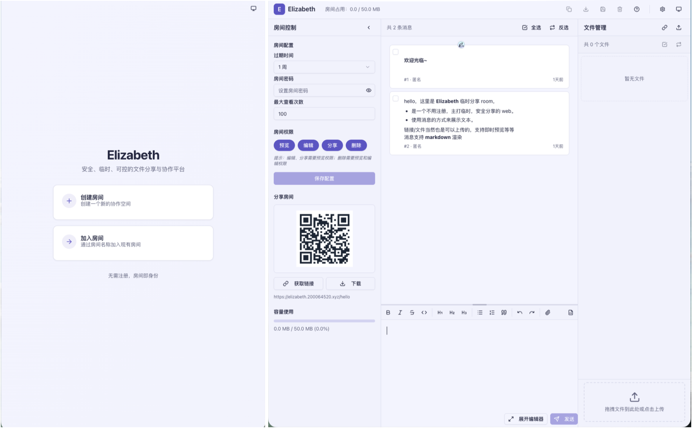

<div align="center">
  <table>
    <tr>
      <td align="center" valign="middle">
        
      </td>
      <td align="center" valign="middle">
        
      </td>
    </tr>
  </table>
  <a href="https://signature4u.vercel.app">Animated Sign generated by Animated Sign 4u</a>
  <br />
  <a href="./README.en.md">English</a>
  <span> | </span>
  <a href="./README.md">中文介绍</a>
</div>

<div align="center">
  <p><strong>Elizabeth</strong> 是一个以房间为中心的实时文件共享与协作平台：在同一个入口里完成建房、消息同步、拖拽上传、图片 / PDF / 文本预览，以及链接邀请分享。</p>
  <p>它采用 Rust + Next.js 技术栈构建，单容器即可交付 API、WebSocket 与嵌入式 SPA 前端；默认使用 SQLite，也可按需切换到 PostgreSQL。</p>
  
</div>

# Elizabeth

房间驱动的实时文件共享与协作平台，聚合消息、上传、预览与分享链接于同一工作流。

<div align="center">

[](https://www.gnu.org/licenses/agpl-3.0)
[](https://www.rust-lang.org/)
[](https://nextjs.org/)
[](https://www.postgresql.org/)
[](https://github.com/j178/prek)

</div>

---

## 快速导航

- **[Docker 快速开始](docs/DOCKER_QUICK_START.md)**：最快把 Elizabeth
  跑起来的单机部署路径。
- **[部署指南](docs/DEPLOYMENT.md)**：生产环境部署、反向代理与上线前准备。
- **[API 指南](docs/API_GUIDE.md)**：核心 REST API、鉴权与内容接口概览。
- **[WebSocket 指南](docs/WEBSOCKET_GUIDE.md)**：实时同步与信令传输入口。
- **[架构说明](docs/ARCHITECTURE.md)**：后端、前端与存储层的整体设计。

---

## 核心能力

- **Room-centric
  协作模型**：所有消息、文件与实时互动都围绕房间展开，分享路径直接、上手成本低。
- **单容器、单端口交付**：Rust 后端统一承载 API、WebSocket
  与嵌入式前端静态资源，部署链路简单清晰。
- **实时消息与多类型预览**：支持 Markdown、代码高亮、图片预览、PDF
  阅读器、文本文件查看与链接预览。
- **SQLite 默认，PostgreSQL 可切换**：开发期可用轻量 SQLite，生产环境可通过
  `DATABASE_URL` 平滑切换至 PostgreSQL。
- **OpenAPI / Scalar 开箱即用**：自带交互式 API
  文档，便于二次集成、联调与自动化。
- **安全基线完整**：内置 JWT 鉴权、房间权限控制与最小权限容器运行策略。

---

## 部署与使用

Elizabeth 的正式镜像发布在
[Docker Hub `yunique001/elizabeth`](https://hub.docker.com/r/yunique001/elizabeth)，支持
`linux/amd64` 与 `linux/arm64`。默认使用 SQLite；需要 PostgreSQL
时可以直接叠加仓库提供的 Compose override。

| 部署方式                        | 是否需要克隆仓库 | 是否在本机构建 | 持久化方式           | 适合场景                     |
| :------------------------------ | :--------------- | :------------- | :------------------- | :--------------------------- |
| Docker Hub + `docker run`       | 否               | 否             | Docker named volumes | 最快体验、单机或反向代理部署 |
| Docker Hub + Docker Compose     | 是               | 否             | 默认使用宿主机目录   | 易维护、可配置的长期部署     |
| Docker Compose / `docker build` | 是               | 是             | 默认使用宿主机目录   | 开发分支、定制镜像           |
| Rust + Bun 原生构建             | 是               | 是             | 使用本机配置         | 本地开发与调试               |

### 选择镜像版本

生产部署推荐固定精确版本，避免 `latest` 在重建容器时发生非预期升级。下面的版本由
release-please 在 Release PR 中自动更新。

<!-- x-release-please-start-version -->

```bash
export ELIZABETH_VERSION=1.4.0
```

<!-- x-release-please-end -->

手动拉取镜像：

```bash
docker pull "yunique001/elizabeth:${ELIZABETH_VERSION}"
```

如果只是临时体验，也可以拉取
`yunique001/elizabeth:latest`；长期部署仍建议使用精确版本。

### 方式一：Docker Hub 一键启动（推荐最快）

镜像已经包含 Rust 服务、嵌入式 Web 前端、数据库 migrations、默认 YAML
配置和健康检查所需的 `curl`，无需克隆仓库。先生成并保存一个稳定的 JWT 密钥：

```bash
umask 077
printf 'JWT_SECRET=%s\n' "$(openssl rand -hex 32)" > .env.elizabeth # pragma: allowlist secret
```

然后运行容器：

```bash
docker run -d \
  --name elizabeth \
  --restart unless-stopped \
  --init \
  --read-only \
  --security-opt no-new-privileges:true \
  --cap-drop ALL \
  --tmpfs /tmp \
  -p 127.0.0.1:4092:4092 \
  --env-file .env.elizabeth \
  -v elizabeth-data:/app/data \
  -v elizabeth-storage:/app/storage \
  --health-cmd='curl -fsS http://127.0.0.1:4092/api/v1/health || exit 1' \
  --health-interval=30s \
  --health-timeout=10s \
  --health-retries=3 \
  --health-start-period=10s \
  "yunique001/elizabeth:${ELIZABETH_VERSION}"
```

> [!IMPORTANT]
> 请安全保存 `.env.elizabeth`，并在重建或升级容器时复用同一个
> `JWT_SECRET`。重新生成密钥会让已有 token 全部失效；不要把该文件提交到版本库。

该命令默认只监听本机 `127.0.0.1:4092`，适合在前面配置 HTTPS
反向代理。需要直接提供给局域网访问时，可改为 `-p 4092:4092`；不建议将未启用 TLS
的 HTTP 端口直接暴露到公网。

### 方式二：Docker Compose 拉取预构建镜像

Compose 方式会复用仓库中的 `.env.docker`、YAML 配置、数据目录准备脚本和
PostgreSQL override。以下命令只拉取 Docker Hub 镜像，不在本机编译：

```bash
git clone --branch "v${ELIZABETH_VERSION}" --depth 1 \
  https://github.com/YuniqueUnic/elizabeth.git
cd elizabeth

cp .env.docker .env
${EDITOR:-nano} .env

./scripts/docker_prepare_volumes.sh
docker compose pull backend
docker compose up -d --no-build
```

生产环境必须修改 `.env` 中的
`JWT_SECRET`。如果需要选择其他已发布版本，可以在当前 shell 中设置
`ELIZABETH_IMAGE=yunique001/elizabeth:<version>` 后再执行 Compose 命令。

### 方式三：从源码自行构建 Docker 镜像

使用 Compose 构建当前 checkout，并用本地镜像名避免覆盖 Docker Hub 官方镜像的本地
tag：

```bash
git clone https://github.com/YuniqueUnic/elizabeth.git
cd elizabeth

cp .env.docker .env
${EDITOR:-nano} .env

./scripts/docker_prepare_volumes.sh
ELIZABETH_IMAGE=elizabeth:local docker compose up -d --build
```

也可以只构建镜像，再复用“方式一”的 `docker run` 参数：

```bash
docker build \
  --target runtime \
  -f Dockerfile.backend \
  -t elizabeth:local \
  .
```

### 方式四：Rust + Bun 原生构建

本地需要安装仓库指定的 Rust toolchain、Bun，以及可选的
[`just`](https://github.com/casey/just)。推荐直接运行：

```bash
cd web
bun install --frozen-lockfile
bun run build:embedded
cd ..

ELIZABETH_SKIP_WEB_BUILD=1 cargo build --release -p elizabeth-board
```

构建产物位于 `target/release/board`。本地开发可使用 `just dev`；完整 release
构建可使用 `just build`。

### 使用 PostgreSQL

Elizabeth 根据 `DATABASE_URL` 的协议自动选择 SQLite 或 PostgreSQL migrations。

使用仓库提供的 PostgreSQL 容器时，先在 `.env` 中设置安全的
`POSTGRES_PASSWORD`，再运行：

```bash
docker compose \
  -f docker-compose.yml \
  -f docker-compose.postgres.yml \
  pull

docker compose \
  -f docker-compose.yml \
  -f docker-compose.postgres.yml \
  up -d --no-build
```

如果需要从当前源码构建，将最后一条命令的 `--no-build` 替换为 `--build`，并设置
`ELIZABETH_IMAGE=elizabeth:local`。

使用外部 PostgreSQL 时，在 `.env` 中设置连接串，并确保后端容器可以访问目标主机：

```env
DATABASE_URL=postgresql://用户名:密码@主机名:端口/数据库名 # pragma: allowlist secret
```

### 配置与持久化

容器内关键路径：

| 路径                       | 内容                                       | 是否必须持久化               |
| :------------------------- | :----------------------------------------- | :--------------------------- |
| `/app/data`                | SQLite 数据库                              | 使用 SQLite 时必须           |
| `/app/storage`             | 房间上传文件                               | 必须                         |
| `/app/config/backend.yaml` | 部署级默认配置、房间策略与 middleware 配置 | 可使用镜像内置版本或只读挂载 |

`docker run` 示例使用 named volumes；Compose 默认将它们绑定到
`./docker/backend/data`、`./docker/backend/storage` 和
`./docker/backend/config/backend.yaml`，也可以通过 `.env` 中的
`ELIZABETH_DATA_DIR`、`ELIZABETH_STORAGE_DIR`、`ELIZABETH_BACKEND_CONFIG` 覆盖。

常用环境变量：

| 环境变量                            | 默认值                            | 作用说明                                          |
| :---------------------------------- | :-------------------------------- | :------------------------------------------------ |
| `JWT_SECRET`                        | 示例值，仅供启动                  | 签名认证令牌；生产环境必须设置稳定的 32+ 字符密钥 |
| `DATABASE_URL`                      | `sqlite:///app/data/elizabeth.db` | 数据库连接串，协议决定驱动和 migrations           |
| `BACKEND_PORT`                      | `4092`                            | Compose 暴露到宿主机的端口                        |
| `ROOM_MAX_SIZE`                     | `50MiB`                           | 新房间默认容量，支持 `50M`、`100M`、`1G`、`1GiB`  |
| `ROOM_MAX_TIMES_ENTERED`            | `100`                             | 新房间默认最大进入次数                            |
| `ROOM_DEFAULT_AGE`                  | `2h`                              | 新房间默认过期时间，支持 `m`、`h`、`d`、`w`       |
| `ROOM_DEFAULT_PASSWORD`             | 空                                | 新房间默认密码；空值表示无密码                    |
| `ROOM_DEFAULT_PERMISSION_*`         | `true`                            | 新房间 read/edit/share/delete 四位默认权限        |
| `ROOM_SHARE_DISABLED_LOCK_DURATION` | `1h`                              | 关闭分享后的锁定时长，支持 humantime 单位         |

镜像内置配置位于 `/app/config/backend.yaml`，仓库模板位于
`docker/backend/config/backend.yaml`。YAML 不执行 `${VAR}`
插值；容器环境变量会在启动时覆盖对应 YAML 值。Compose 已显式传递 `.env.docker`
中的数据库、JWT、房间、上传、GC、日志和 middleware 配置。

### 启动验证与日常维护

部署成功后可访问：

- Web：`http://localhost:4092/`
- 健康检查：`http://localhost:4092/api/v1/health`
- Scalar API 文档：`http://localhost:4092/api/v1/scalar`
- OpenAPI JSON：`http://localhost:4092/api/v1/openapi.json`

常用 Compose 命令：

```bash
docker compose ps
docker compose logs -f backend
curl -fsS http://127.0.0.1:4092/api/v1/health
docker compose down --remove-orphans
```

升级预构建镜像时，先切换到目标 release，再拉取并重建容器：

```bash
docker compose pull backend
docker compose up -d --no-build --remove-orphans
```

直接使用 `docker run` 的部署，应先拉取新版本、删除旧容器，再使用相同的
`.env.elizabeth`、端口和 `elizabeth-data` / `elizabeth-storage` volumes
重新执行启动命令。升级或停止容器时不要删除数据卷。

---

## 质量门禁与本地开发

在本地参与 Rust 模块开发时，必须确保以下指令全部正常通过：

```bash
# 格式化代码风格
cargo fmt --all

# 静态检查 workspace 语法与编译正确性
cargo check --workspace --all-targets --all-features

# 运行 workspace 内部的所有自动化测试
cargo test --workspace --all-features

# Clippy 强静态类型质量门禁（不能包含任何警告或错误）
cargo clippy --workspace --all-targets --all-features -- -D warnings
```

> [!TIP]
> 如果本地装有 [just](https://github.com/casey/just)，您也可以直接使用命令
> `just verify` 一键跑通上述所有的校验。

---

## 文档指南

若要探索和深入了解 Elizabeth，请参阅我们为您准备的系统化文档：

- **[docs/README.md](docs/README.md)**：项目文档导航主索引。
- **[docs/DOCKER_QUICK_START.md](docs/DOCKER_QUICK_START.md)**：极简的 Docker
  快速上路部署手册。
- **[docs/DEPLOYMENT.md](docs/DEPLOYMENT.md)**：生产级环境部署、云服务配置及
  Nginx/反向代理的最佳实践。
- **[docs/API_GUIDE.md](docs/API_GUIDE.md)**：系统底层核心 RESTful API
  调用与字段详情说明。
- **[docs/WEBSOCKET_GUIDE.md](docs/WEBSOCKET_GUIDE.md)**：WebSocket
  长连接房间状态同步与信令传输协议。
- **[docs/ARCHITECTURE.md](docs/ARCHITECTURE.md)**：项目宏观架构设计、多层逻辑解耦与底层技术深度实现。

---

## 开源许可证 (License)

本项目采用
**[GNU Affero General Public License v3.0 (AGPL-3.0)](https://www.gnu.org/licenses/agpl-3.0.html)**
开源许可证托管。

> [!IMPORTANT]
> **AGPL-3.0 协议与商业授权说明：**
>
> - 任何人均有权自由地商用、修改或分发本项目的全部或部分源代码。
> - **开源义务**：如果您对本项目的源代码进行了任何修改，并且利用修改后的源码通过网络以软件即服务（SaaS）的形式向公众提供服务，**您必须根据
>   AGPL-3.0 的条款向公众开源并公布修改后的完整源代码**。
> - 如果您没有对 Elizabeth
>   的源代码进行任何修改（仅作为直接部署使用者进行商业运营、团队协作或个人自建），或者您的修改仅限在企业/个人内部私有环境使用且不对外提供网络服务，则您无需公开任何源代码。
