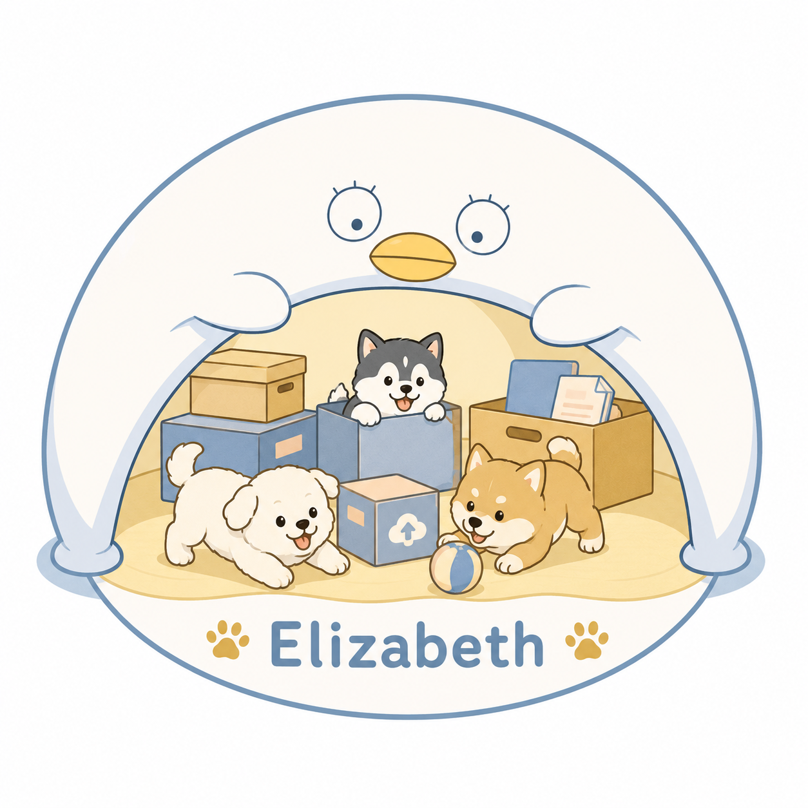

<div align="center">
  
  </br>
  <a href="https://signature4u.vercel.app">Animated Sign generated by Animated Sign 4u</a>
  <div style="display: flex; justify-content: center;">
    <a href="./README.en.md">English</a>
      <a style="margin-left: 8px; margin-right: 8px;">|</a>
    <a href="./README.md">中文介绍</a>
  </div>
  </br>
</div>

<div align="center">
  <p>Elizabeth 是一个现代化的、以房间为中心（room-centric）的文件分享与协作平台，采用 Rust + Next.js 技术栈构建。</p>
  
</div>

<div align="center">

[](https://www.gnu.org/licenses/agpl-3.0)
[](https://www.rust-lang.org/)
[](https://nextjs.org/)
[](https://www.postgresql.org/)
[](https://github.com/j178/prek)

</div>

---

## ✨ 项目特色

* **🚪 以房间为中心 (Room-centric)**：独特的设计模式，所有文件分享、互动与实时协作均围绕“虚拟房间”展开。
* **⚡ 极致的高性能后端**：基于 **Rust + Axum + SQLx** 强力驱动，内存占用极低，并发处理极为强悍。
* **🎨 现代化响应式前端**：采用 **Next.js** 构建，具备极佳的交互细节、动态视效以及全平台响应式体验。
* **💾 双数据库驱动自适应**：原生同时支持 **SQLite** 和 **PostgreSQL**。仅需一行环境变量配置，即可在本地开发轻量 SQLite 和生产级 PostgreSQL 之间无缝自适应切换。
* **📝 内置 OpenAPI / Scalar 交互式文档**：开箱即用的高阶 Scalar API 文档接口，让开发对接如丝般顺滑。
* **🔒 强安全保障**：基于 JWT 认证与完善的秘钥管理，确保多租户与多房间协作下的文件安全性。

---

## 🚀 快速开始 (Docker 部署，默认使用 SQLite)

一键拉取并部署项目（默认搭载轻量级 SQLite 数据库驱动）：

```bash
# 1. 克隆仓库
git clone https://github.com/YuniqueUnic/elizabeth.git
cd elizabeth

# 2. 准备环境变量配置文件
cp .env.docker .env

# 3. 生产环境务必修改 JWT_SECRET（推荐长度 >= 32 字符的随机安全字符串）
${EDITOR:-nano} .env

# 4. 一键构建并拉起服务
docker compose up -d --build
```

### 🧭 访问地址索引

部署成功后，您可以通过以下入口访问和调试服务：

* **🌐 Web 前端界面**：`http://localhost:4001`
* **📑 Scalar 交互式接口文档**：`http://localhost:4001/api/v1/scalar`
* **📄 OpenAPI 描述文件 (JSON)**：`http://localhost:4001/api/v1/openapi.json`
* **🩺 健康检查接口**：`http://localhost:4001/api/v1/health`

---

## 💾 高级数据库配置 (自适应驱动切换)

Elizabeth 依靠 `sqlx::AnyPool` 具备出色的数据库自适应能力，能够根据 `.env` 中传入的 `DATABASE_URL` 的协议头自动决策装载哪套驱动，且在迁移（Migrations）上实现了智能切换：

* **轻量级 SQLite**（默认，使用 `./crates/board/migrations` / 容器内 `/app/migrations`）
* **生产级 PostgreSQL**（使用 `./crates/board/migrations_pg` / 容器内 `/app/migrations_pg`）

### 🐳 使用内置 PostgreSQL 容器部署（推荐生产环境）

如果您希望配合内置的 PostgreSQL 容器一同拉起服务，只需运行：

```bash
docker compose -f docker-compose.yml -f docker-compose.postgres.yml up -d --build
```

### 🔌 使用外部已有的 PostgreSQL

如果您有独立部署的外部 PostgreSQL 数据库，请在 `.env` 中修改连接串（确保后端 Docker 容器具有网络访问权限）：

```env
DATABASE_URL=postgresql://用户名:密码@主机名:端口/数据库名
```

---

## ⚙️ 关键配置说明

在 Docker 容器化环境下，推荐通过项目根目录的 `.env` 环境变量配置文件覆盖核心行为：

| 环境变量 | 默认值 | 作用说明 |
| :--- | :--- | :--- |
| `JWT_SECRET` | （必填） | 用于生成和签名认证令牌的秘钥。生产环境请务必修改。 |
| `DATABASE_URL` | `sqlite://data/board.db?mode=rwc` | 数据库连接串。协议头决定了使用的驱动类型。 |
| `DB_MAX_CONNECTIONS` | `10` | 数据库连接池的最大连接数上限。 |
| `DB_MIN_CONNECTIONS` | `2` | 数据库连接池保留的最小连接数常驻。 |

> [!NOTE]
> 项目的静态配置文件位于 `docker/backend/config/backend.yaml`，该文件在运行时加载（注：YAML 自身不支持动态读取环境变量，密钥和高敏感配置均推荐使用 env 注入来覆盖）。

---

## 🛡️ 质量门禁与本地开发

在本地参与 Rust 模块开发时，必须确保以下指令全部正常通过：

```bash
# 1. 格式化代码风格
cargo fmt --all

# 2. 静态检查 workspace 语法与编译正确性
cargo check --workspace --all-targets --all-features

# 3. 运行 workspace 内部的所有自动化测试
cargo test --workspace --all-features

# 4. Clippy 强静态类型质量门禁（不能包含任何警告或错误）
cargo clippy --workspace --all-targets --all-features -- -D warnings
```

> [!TIP]
> 如果本地装有 [just](https://github.com/casey/just)，您也可以直接使用命令 `just verify` 一键跑通上述所有的校验。

---

## 📚 文档指南

若要探索和深入了解 Elizabeth，请参阅我们为您准备的系统化文档：

* **📁 [docs/README.md](file:///Users/unic/dev/rs/elizabeth/docs/README.md)**：项目文档导航主索引。
* **⚡ [docs/DOCKER_QUICK_START.md](file:///Users/unic/dev/rs/elizabeth/docs/DOCKER_QUICK_START.md)**：极致简约的 Docker 快速上路部署手册。
* **☁️ [docs/DEPLOYMENT.md](file:///Users/unic/dev/rs/elizabeth/docs/DEPLOYMENT.md)**：生产级环境部署、云服务配置及 Nginx/反向代理的最佳实践。
* **📡 [docs/API_GUIDE.md](file:///Users/unic/dev/rs/elizabeth/docs/API_GUIDE.md)**：系统底层核心 RESTful API 调用与字段详情说明。
* **🔌 [docs/WEBSOCKET_GUIDE.md](file:///Users/unic/dev/rs/elizabeth/docs/WEBSOCKET_GUIDE.md)**：WebSocket 长连接房间状态同步与信令传输协议。
* **🏗️ [docs/ARCHITECTURE.md](file:///Users/unic/dev/rs/elizabeth/docs/ARCHITECTURE.md)**：项目宏观架构设计、多层逻辑解耦与底层技术深度实现。

---

## ⚖️ 开源许可证 (License)

本项目采用 **[GNU Affero General Public License v3.0 (AGPL-3.0)](https://www.gnu.org/licenses/agpl-3.0.html)** 开源许可证托管。

> [!IMPORTANT]
> **AGPL-3.0 协议精髓与商业授权说明：**
> * 任何人均有权自由地商用、修改或分发本项目的全部或部分源代码。
> * **开源义务**：如果您对本项目的源代码进行了任何修改，并且利用修改后的源码通过网络以软件即服务（SaaS）的形式向公众提供服务，**您必须根据 AGPL-3.0 的条款向公众开源并公布修改后的完整源代码**。
> * 如果您不对 Elizabeth 的源码进行任何修改（仅作为直接部署使用者进行商用、协作或自建使用），或者不需要将修改后的代码开放，可以忽略本条开源限制。
