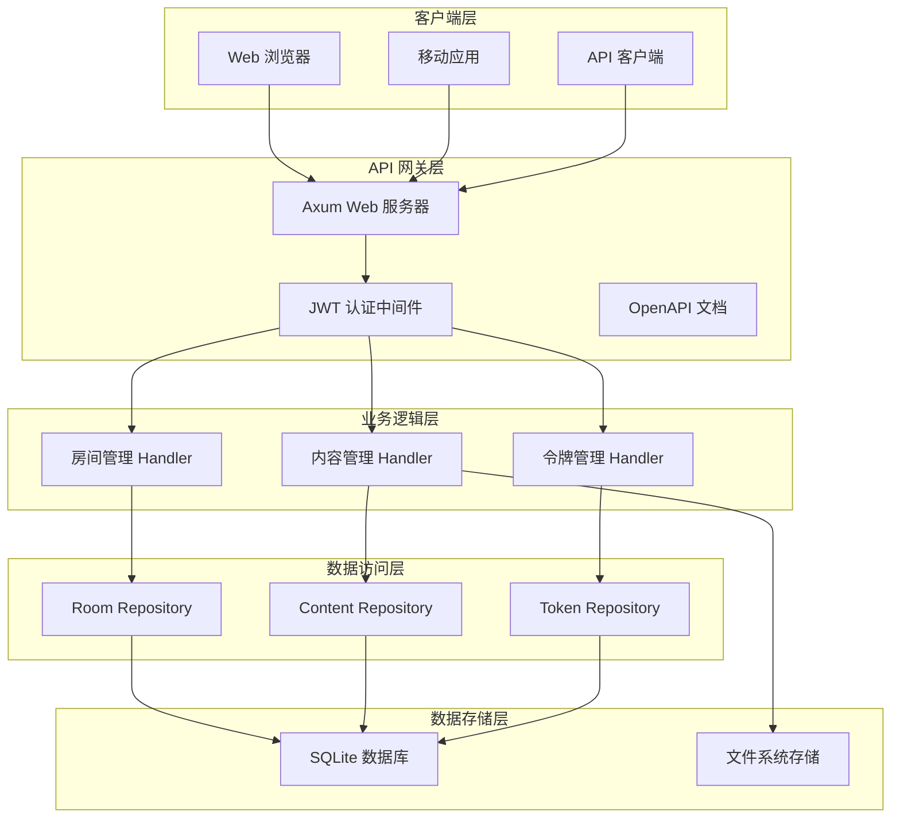
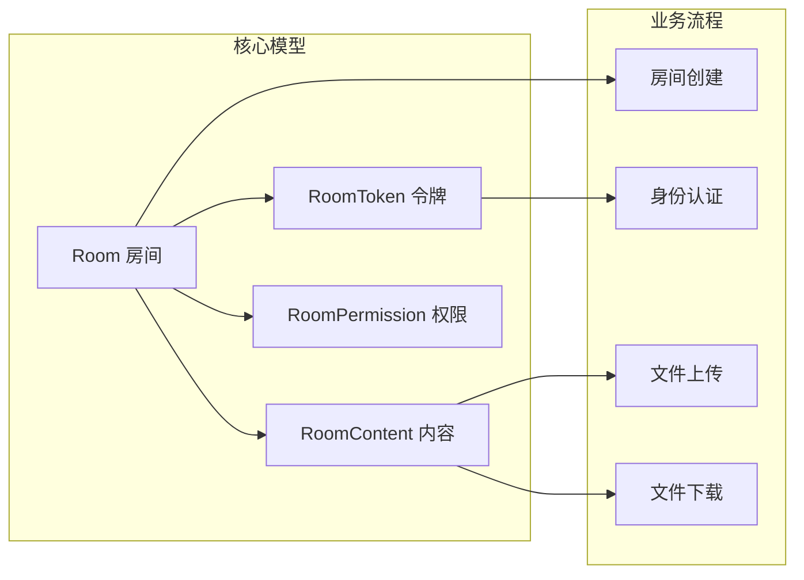
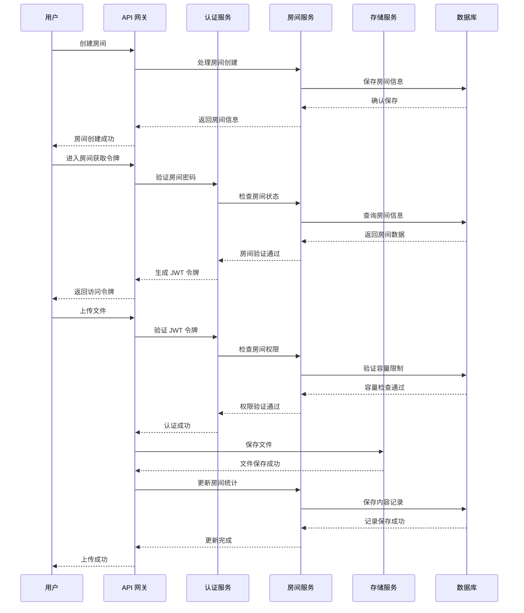
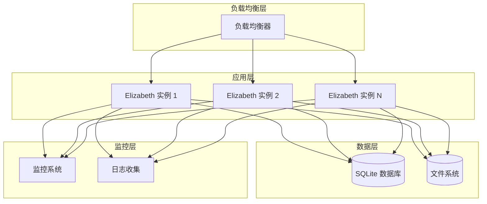

# Elizabeth 文档总览

## 📖 项目概述

Elizabeth 是一个基于 Rust
的现代化文件分享和协作平台项目，采用**房间为中心**的设计理念，提供加密、限时、限量、限次的安全文件共享服务。

### 🎯 核心价值

- **无用户系统设计**：摒弃传统的用户注册登录机制，降低使用门槛
- **房间即身份**：通过进入临时房间实现身份验证，简化权限管理
- **安全优先**：全链路加密支持，包括传输安全和存储安全
- **临时性与可控性**：房间支持过期时间、进入次数限制、文件大小限制

### 🚀 技术特色

- **高性能**：基于 Rust 的高性能文件处理
- **安全性**：内存安全和数据加密
- **多格式支持**：文本、图片、代码片段等多种文件类型
- **Web 界面**：现代化的用户界面
- **云存储集成**：支持 Cloudflare R2 等 S3 兼容存储

### 🏠 Room 系统

支持密码保护的房间系统，实现安全的内容分享：

- ✅ **创建房间**：支持设置密码、过期时间、访问限制
- ✅ **查询房间**：按名称或 ID 查询房间信息
- ✅ **更新房间**：修改房间配置和权限设置
- ✅ **删除房间**：安全删除房间及其相关内容
- ✅ **权限控制**：支持编辑、下载、预览权限管理
- ✅ **过期管理**：自动处理过期房间

## 📚 文档导航

### 🎭 按角色分类的阅读路线

#### 👨‍💻 开发者路线

```
快速开始 → 架构概览 → 模型文档 → 处理器文档 → API 参考 → 开发指南
```

1. **新手开发者**：快速开始 → 项目概述 → 开发指南
2. **进阶开发者**：架构概览 → 模型文档 → 处理器文档 → 系统文档
3. **核心开发者**：跨模型系统文档 → API 参考 → 贡献指南

#### 🔧 运维工程师路线

```
项目概述 → 运维指南 → 系统文档 → 故障排查 → 监控告警
```

1. **基础运维**：项目概述 → 运维指南 → 常见问题
2. **高级运维**：系统文档 → 架构概览 → 监控告警
3. **故障处理**：故障排查 → 常见问题 → 系统文档

#### 📊 产品经理路线

```
项目概述 → 关键特性 → API 参考 → 常见问题 → 贡献指南
```

### 🎓 按复杂度分类的学习路径

#### 🌱 新手路径（3 步读懂项目）

1. **[项目概述](#项目概述)** → 了解 Elizabeth 的核心价值
2. **[快速开始](#快速开始)** → 15 分钟运行第一个实例
3. **[关键特性](#关键特性说明)** → 理解房间为中心的设计理念

#### 🚀 进阶路径（深入系统架构）

1. **[架构概览](#架构总览)** → 理解系统整体设计
2. **[模型文档](#模型文档)** → 掌握数据结构和业务实体
3. **[处理器文档](#处理器文档)** → 了解 API 接口和业务逻辑

#### 🧠 专家路径（掌握核心技术）

1. **[系统文档](#系统文档)** → 深入基础设施和技术组件
2. **[跨模型系统文档](#跨模型系统文档)** → 理解端到端业务流程
3. **[开发指南](#开发指南)** → 参与代码贡献和系统改进

## 🏗️ 架构总览

### 系统整体架构图



### 核心组件关系图



### 数据流和业务流程概览



## 📋 文档分类说明

### 🏗️ 架构文档

| 文档                                       | 描述                           | 目标读者 |
| ------------------------------------------ | ------------------------------ | -------- |
| [架构概览](implementation/architecture.md) | 系统整体架构、组件清单、数据流 | 所有角色 |

### 📊 模型文档

| 文档                                            | 描述                                    | 核心内容         |
| ----------------------------------------------- | --------------------------------------- | ---------------- |
| [房间模型](implementation/model-room.md)        | Room 模型的数据结构、业务规则、API 接口 | 房间生命周期管理 |
| [会话模型](implementation/model-session-jwt.md) | JWT 令牌机制、会话管理、权限验证        | 身份认证系统     |
| [权限模型](implementation/model-permissions.md) | 权限位标志、权限验证、权限管理          | 访问控制系统     |
| [文件模型](implementation/model-file.md)        | 文件内容管理、存储策略、元数据          | 文件处理系统     |

### 🔧 处理器文档

| 文档                                             | 描述                             | 主要功能     |
| ------------------------------------------------ | -------------------------------- | ------------ |
| [上传处理器](implementation/handler-upload.md)   | 文件上传流程、预留机制、安全验证 | 文件上传管理 |
| [下载处理器](implementation/handler-download.md) | 文件下载流程、权限检查、内容分发 | 文件访问控制 |
| [管理员处理器](implementation/handler-admin.md)  | 房间管理、权限设置、系统配置     | 管理功能     |
| [令牌处理器](implementation/handler-token.md)    | 令牌签发、验证、撤销             | 认证管理     |

### ⚙️ 系统文档

| 文档                                         | 描述                         | 技术组件     |
| -------------------------------------------- | ---------------------------- | ------------ |
| [存储系统](implementation/system-storage.md) | 文件存储、路径管理、容量控制 | 存储基础设施 |
| [数据库系统](implementation/system-db.md)    | 数据库设计、迁移、查询优化   | 数据持久化   |
| [认证系统](implementation/system-auth.md)    | JWT 认证、权限验证、安全管理 | 身份认证     |
| [加密系统](implementation/system-crypto.md)  | 加密算法、密钥管理、安全策略 | 数据安全     |
| [队列系统](implementation/system-queue.md)   | 任务队列、异步处理、性能优化 | 任务调度     |

### 🔄 跨模型系统文档

| 文档                                             | 描述                               | 业务流程           |
| ------------------------------------------------ | ---------------------------------- | ------------------ |
| [房间生命周期管理](implementation/System-1.md)   | 房间创建、访问、权限变更、过期清理 | 完整的房间生命周期 |
| [端到端文件上传管道](implementation/System-2.md) | 文件预留、上传、验证、存储流程     | 文件上传完整流程   |

## ✨ 关键特性说明

### 🏠 房间为中心的设计理念

Elizabeth 的核心设计理念是 **"Room" 而不是
"User"**，所有操作都围绕临时的、可配置的房间展开：

1. **无用户系统 (User-less)**：系统不设用户注册或登录，降低使用门槛
2. **房间即身份 (Room as Identity)**：通过进入房间实现身份验证，简化权限管理
3. **临时性与可控性**：房间支持过期时间、进入次数限制、文件大小限制
4. **权限嵌入机制**：JWT Token 中嵌入权限信息，减少实时数据库查询
5. **安全优先**：全链路加密支持，包括传输安全和存储安全

### 🔐 无用户系统的权限管理

传统的文件分享系统需要复杂的用户管理，而 Elizabeth 通过房间机制简化了这一过程：

- **房间密码**：简单的密码保护机制，无需用户注册
- **JWT 令牌**：无状态的认证机制，支持分布式部署
- **权限位标志**：细粒度的权限控制，支持查看、编辑、删除等操作
- **自动过期**：房间和令牌都有过期机制，确保安全性

### 🛡️ 文件安全和加密机制

Elizabeth 提供多层次的安全保护：

- **传输安全**：强制 HTTPS，防止中间人攻击
- **存储安全**：文件存储路径不可预测，支持加密存储
- **访问控制**：多层权限验证，防止未授权访问
- **文件验证**：文件类型检查、大小限制、病毒扫描（可选）

### ⚡ 高可用性和性能优化

- **异步处理**：基于 Tokio 的异步运行时
- **连接池**：数据库连接池优化
- **预留机制**：避免并发上传冲突
- **缓存策略**：房间信息缓存，减少数据库查询
- **索引优化**：关键查询路径索引优化

## 🛠️ 开发指南

### 🚀 本地开发环境搭建

#### 环境要求

- Rust 1.90+
- Git
- SQLite 3

#### 安装和构建

1. **克隆仓库**
   ```bash
   git clone https://github.com/your-username/elizabeth.git
   cd elizabeth
   ```

2. **构建项目**
   ```bash
   cargo build --release
   ```

3. **运行项目**
   ```bash
   cargo run
   ```

   服务将在 `http://127.0.0.1:8080` 启动

#### 开发环境设置

1. **安装开发依赖**
   ```bash
   cargo install --dev release-plz
   cargo install --dev git-cliff
   cargo install --dev cargo-semver-checks
   ```

2. **运行测试**
   ```bash
   cargo test
   ```

3. **检查代码格式**
   ```bash
   cargo fmt --check
   cargo clippy -- -D warnings
   ```

#### 环境变量配置

创建 `.env` 文件：

```bash
ELIZABETH_ADDR=127.0.0.1
ELIZABETH_PORT=8080
ELIZABETH_DB_URL=sqlite:elizabeth.db
ELIZABETH_JWT_SECRET=your-super-secret-jwt-key-here
ELIZABETH_LOG_LEVEL=debug
ELIZABETH_STORAGE_PATH=./storage
```

### 📝 代码贡献流程

#### 分支策略

- `main`：主分支，保持稳定状态
- `feature/*`：功能分支，用于开发新功能
- `fix/*`：修复分支，用于修复 bug
- `release-plz-*`：发布分支，由 release-plz 自动创建

#### 提交流程

1. 从 main 分支创建功能分支
2. 在功能分支上进行开发和测试
3. 提交代码，使用 Conventional Commits 格式
4. 创建 Pull Request 到 main 分支
5. 代码审查通过后合并
6. 等待自动创建发布 PR

#### Conventional Commits 规范

```bash
# 新功能
git commit -m "feat(auth): add user authentication"

# 修复 bug
git commit -m "fix(login): resolve token expiration issue"

# 破坏性更改
git commit -m "feat(api)!: change user endpoint response format"
```

### 🧪 测试策略和质量保证

#### 测试覆盖

- ✅ Repository 单元测试（8/8 通过）
- ✅ 数据库操作测试
- ⚠️ API 集成测试（待修复）
- ✅ 手动 API 测试验证

#### 测试命令

```bash
# 运行所有测试
cargo test

# 运行特定测试模块
cargo test room_repository_tests
cargo test api_integration_tests
```

#### 代码质量检查

```bash
# 代码格式化
cargo fmt

# 代码检查
cargo clippy -- -D warnings

# 安全检查
cargo audit
```

### 🚀 发布和部署流程

#### 自动化发布

Elizabeth 项目使用 [release-plz](https://release-plz.ieni.dev/)
实现自动化版本发布流程：

1. **日常开发**：在功能分支上进行开发，使用 Conventional Commits 格式提交
2. **合并代码**：将功能分支合并到 main 分支
3. **自动创建发布 PR**：GitHub Actions 自动创建包含版本更新和 changelog 的 PR
4. **审核发布**：审核自动生成的 PR，确认无误后合并
5. **自动发布**：合并 PR 后自动执行发布流程，创建 git 标签

#### 部署配置

**开发环境**：

```bash
ELIZABETH_ADDR=127.0.0.1
ELIZABETH_PORT=8080
ELIZABETH_DB_URL=sqlite:dev.db
ELIZABETH_JWT_SECRET=dev-secret-key-change-in-production
ELIZABETH_LOG_LEVEL=debug
ELIZABETH_STORAGE_PATH=./dev-storage
```

**生产环境**：

```bash
export ELIZABETH_ADDR=0.0.0.0
export ELIZABETH_PORT=8080
export ELIZABETH_DB_URL=sqlite:/data/elizabeth.db
export ELIZABETH_JWT_SECRET=$(openssl rand -base64 32)
export ELIZABETH_LOG_LEVEL=info
export ELIZABETH_STORAGE_PATH=/data/storage
```

## 🔧 运维指南

### 🏗️ 部署架构和配置

#### 系统要求

- **CPU**：2 核心以上
- **内存**：4GB 以上
- **存储**：50GB 以上可用空间
- **网络**：稳定的互联网连接

#### 部署架构



#### 配置管理

**环境变量列表**：

| 变量名                   | 类型   | 默认值                | 说明                     |
| ------------------------ | ------ | --------------------- | ------------------------ |
| `ELIZABETH_ADDR`         | string | `127.0.0.1`           | 服务监听地址             |
| `ELIZABETH_PORT`         | number | `8080`                | 服务监听端口             |
| `ELIZABETH_DB_URL`       | string | `sqlite:elizabeth.db` | 数据库连接字符串         |
| `ELIZABETH_JWT_SECRET`   | string | -                     | JWT 签名密钥（必须设置） |
| `ELIZABETH_LOG_LEVEL`    | string | `info`                | 日志级别                 |
| `ELIZABETH_STORAGE_PATH` | string | `./storage`           | 文件存储路径             |

#### 密钥管理策略

1. **JWT 密钥生成**：
   ```bash
   # 生成强随机密钥
   openssl rand -base64 32
   ```

2. **生产环境密钥管理**：
   - 使用环境变量或密钥管理服务
   - 定期轮换 JWT 密钥（建议每 90 天）
   - 密钥长度至少 32 字符

3. **密钥存储**：
   - 开发环境：可使用 `.env` 文件
   - 生产环境：使用 Kubernetes Secrets 或 AWS Secrets Manager

### 📊 监控和告警设置

#### 关键监控指标

**业务指标**：

- 房间创建成功率：目标 > 99%
- 文件上传成功率：目标 > 98%
- 平均房间生命周期：监控使用模式
- 权限变更频率：监控管理操作

**技术指标**：

- API 响应时间：P95 < 500ms
- 数据库连接池使用率：< 80%
- 令牌验证成功率：> 99.9%
- 文件操作成功率：> 98%

**安全指标**：

- 异常访问尝试次数
- 权限提升尝试次数
- 密码暴力破解尝试
- 令牌伪造尝试

#### 健康检查端点

```bash
# 检查服务状态
curl http://localhost:8080/api/v1/status

# 检查数据库连接
curl http://localhost:8080/api/v1/health/db

# 检查文件系统
curl http://localhost:8080/api/v1/health/storage
```

#### 告警配置

**业务告警**：

- 房间创建失败率 > 5%
- 令牌验证失败率 > 1%
- 磁盘使用率 > 85%
- 数据库连接数 > 80%

**技术告警**：

- API 响应时间 > 1s
- 错误率 > 5%
- 内存使用率 > 90%
- CPU 使用率 > 80%

### 🔍 故障排查和维护

#### 日志管理

**应用日志**：

- 开发环境：控制台输出
- 生产环境：系统日志 `/var/log/elizabeth/`
- 日志级别：`trace`、`debug`、`info`、`warn`、`error`

**访问日志**：

- 存储在数据库 `room_access_logs` 表
- 记录所有房间访问行为
- 包含 IP 地址、时间戳、操作类型

**错误日志**：

- 结构化 JSON 格式
- 包含错误堆栈信息
- 便于自动化监控和分析

#### 常见错误码及解决方法

| 错误码                   | HTTP 状态 | 错误描述         | 解决方法                   |
| ------------------------ | --------- | ---------------- | -------------------------- |
| `ROOM_NOT_FOUND`         | 404       | 房间不存在       | 检查房间名称是否正确       |
| `ROOM_EXPIRED`           | 403       | 房间已过期       | 联系房间创建者续期         |
| `ROOM_FULL`              | 403       | 房间已满员       | 等待进入次数重置           |
| `INVALID_PASSWORD`       | 401       | 密码错误         | 联系房间创建者获取正确密码 |
| `PERMISSION_DENIED`      | 403       | 权限不足         | 检查 JWT 令牌权限范围      |
| `TOKEN_EXPIRED`          | 401       | 令牌已过期       | 重新获取访问令牌           |
| `TOKEN_REVOKED`          | 401       | 令牌已撤销       | 重新获取访问令牌           |
| `STORAGE_FULL`           | 507       | 存储空间不足     | 联系管理员清理存储         |
| `FILE_TOO_LARGE`         | 413       | 文件过大         | 检查房间文件大小限制       |
| `UNSUPPORTED_MEDIA_TYPE` | 415       | 不支持的媒体类型 | 检查文件格式是否支持       |

#### 故障排查工具

1. **数据库连接检查**：
   ```bash
   sqlite3 elizabeth.db "SELECT COUNT(*) FROM rooms;"
   ```

2. **JWT 令牌验证**：
   ```bash
   # 使用 jwt.io 验证令牌
   curl https://jwt.io/#debugger-io?token=your.jwt.token
   ```

3. **日志分析**：
   ```bash
   # 查看错误日志
   tail -f /var/log/elizabeth/error.log | grep ERROR
   ```

### 💾 备份和恢复策略

#### 数据库备份

```bash
# SQLite 数据库备份
sqlite3 elizabeth.db ".backup backup_$(date +%Y%m%d).db"
```

#### 文件存储备份

```bash
# 文件系统备份
tar -czf storage_backup_$(date +%Y%m%d).tar.gz ./storage/
```

#### 自动化备份

- 使用 cron 定时任务每日备份
- 保留最近 30 天的备份文件
- 备份文件存储到异地存储

## 📡 API 参考

### 🌐 主要 API 端点概览

#### 房间管理 API

| 方法   | 端点                               | 描述         | 权限要求 |
| ------ | ---------------------------------- | ------------ | -------- |
| POST   | `/api/v1/rooms/{name}`             | 创建房间     | 无       |
| GET    | `/api/v1/rooms/{name}`             | 查询房间     | 查看权限 |
| DELETE | `/api/v1/rooms/{name}`             | 删除房间     | 删除权限 |
| POST   | `/api/v1/rooms/{name}/tokens`      | 获取访问令牌 | 无       |
| POST   | `/api/v1/rooms/{name}/permissions` | 更新房间权限 | 删除权限 |

#### 内容管理 API

| 方法   | 端点                                    | 描述         | 权限要求 |
| ------ | --------------------------------------- | ------------ | -------- |
| POST   | `/api/v1/rooms/{name}/contents/prepare` | 预留上传空间 | 编辑权限 |
| POST   | `/api/v1/rooms/{name}/contents`         | 上传文件     | 编辑权限 |
| GET    | `/api/v1/rooms/{name}/contents`         | 获取内容列表 | 查看权限 |
| GET    | `/api/v1/rooms/{name}/contents/{id}`    | 下载文件     | 下载权限 |
| DELETE | `/api/v1/rooms/{name}/contents/{id}`    | 删除文件     | 删除权限 |

#### 系统 API

| 方法 | 端点                     | 描述           | 权限要求 |
| ---- | ------------------------ | -------------- | -------- |
| GET  | `/api/v1/status`         | 系统状态       | 无       |
| GET  | `/api/v1/health/db`      | 数据库健康检查 | 无       |
| GET  | `/api/v1/health/storage` | 存储健康检查   | 无       |

#### 认证 API

| 方法   | 端点                   | 描述         | 权限要求   |
| ------ | ---------------------- | ------------ | ---------- |
| POST   | `/api/v1/auth/refresh` | 刷新访问令牌 | 无         |
| POST   | `/api/v1/auth/logout`  | 撤销访问令牌 | 无         |
| DELETE | `/api/v1/auth/cleanup` | 清理过期令牌 | 管理员权限 |

### 🔐 认证和权限说明

#### JWT 令牌结构

```json
{
  "sub": "room:1",
  "room_id": 1,
  "room_name": "myroom",
  "permission": 15,
  "max_size": 10485760,
  "exp": 1704067200,
  "iat": 1704063600,
  "jti": "550e8400-e29b-41d4-a716-446655440000"
}
```

#### 权限位标志

| 权限      | 位标志 | 描述     |
| --------- | ------ | -------- |
| VIEW_ONLY | 1      | 查看权限 |
| EDITABLE  | 2      | 编辑权限 |
| SHARE     | 4      | 分享权限 |
| DELETE    | 8      | 删除权限 |

#### 认证流程

1. **创建房间**：通过 `POST /api/v1/rooms/{name}` 创建房间
2. **获取令牌**：通过 `POST /api/v1/rooms/{name}/tokens`
   获取访问令牌（可选刷新令牌）
3. **使用令牌**：在后续请求中通过 `?token=JWT` 参数传递令牌
4. **权限验证**：系统自动验证令牌中的权限信息
5. **令牌刷新**：通过 `POST /api/v1/auth/refresh` 使用刷新令牌获取新的访问令牌

#### 刷新令牌机制

Elizabeth 实现了基于 JWT 的刷新令牌机制，允许用户在访问令牌过期后无缝续期访问：

**刷新令牌特性**：

- **长期有效**：刷新令牌默认有效期为 7 天
- **一次性使用**：每次刷新后，旧的刷新令牌会被撤销
- **安全存储**：刷新令牌在数据库中哈希存储，防止泄露
- **自动清理**：系统定期清理过期的刷新令牌

**刷新令牌流程**：

1. **首次获取**：在获取访问令牌时，可选择同时获取刷新令牌
2. **令牌刷新**：访问令牌过期后，使用刷新令牌获取新的令牌对
3. **自动轮换**：每次刷新后，会生成新的刷新令牌，旧的自动失效
4. **安全撤销**：支持主动撤销访问令牌和关联的刷新令牌

**刷新令牌请求示例**：

```bash
# 使用刷新令牌获取新的访问令牌
curl -X POST "http://127.0.0.1:8080/api/v1/auth/refresh" \
  -H "Content-Type: application/json" \
  -d '{"refresh_token": "your_refresh_token"}'
```

**刷新令牌响应示例**：

```json
{
  "access_token": "eyJhbGciOiJIUzI1NiIsInR5cCI6IkpXVCJ9...",
  "refresh_token": "eyJhbGciOiJIUzI1NiIsInR5cCI6IkpXVCJ9...",
  "access_token_expires_at": "2023-01-01T12:00:00Z",
  "refresh_token_expires_at": "2023-01-08T12:00:00Z"
}
```

### ❌ 错误码和状态码

#### HTTP 状态码

| 状态码 | 含义                   | 常见场景         |
| ------ | ---------------------- | ---------------- |
| 200    | OK                     | 请求成功         |
| 400    | Bad Request            | 参数错误         |
| 401    | Unauthorized           | 认证失败         |
| 403    | Forbidden              | 权限不足         |
| 404    | Not Found              | 资源不存在       |
| 409    | Conflict               | 资源冲突         |
| 410    | Gone                   | 资源已过期       |
| 413    | Payload Too Large      | 文件过大         |
| 415    | Unsupported Media Type | 不支持的文件类型 |
| 500    | Internal Server Error  | 服务器内部错误   |
| 507    | Insufficient Storage   | 存储空间不足     |

#### 业务错误码

| 错误码              | 描述         | 解决方法       |
| ------------------- | ------------ | -------------- |
| `ROOM_NOT_FOUND`    | 房间不存在   | 检查房间名称   |
| `ROOM_EXPIRED`      | 房间已过期   | 联系创建者续期 |
| `ROOM_FULL`         | 房间已满员   | 等待重置       |
| `INVALID_PASSWORD`  | 密码错误     | 获取正确密码   |
| `PERMISSION_DENIED` | 权限不足     | 检查令牌权限   |
| `TOKEN_EXPIRED`     | 令牌已过期   | 重新获取令牌   |
| `STORAGE_FULL`      | 存储空间不足 | 联系管理员     |

### 💡 API 使用示例

#### 创建房间

```bash
# 创建带密码的房间
curl -X POST "http://127.0.0.1:8080/api/v1/rooms/myroom?password=secret123"
```

#### 获取访问令牌

```bash
# 获取房间访问令牌
curl -X POST "http://127.0.0.1:8080/api/v1/rooms/myroom/tokens" \
  -H "Content-Type: application/json" \
  -d '{"password": "secret123", "token": null}'
```

#### 上传文件

```bash
# 预留上传空间
curl -X POST "http://127.0.0.1:8080/api/v1/rooms/myroom/contents/prepare?token=YOUR_JWT_TOKEN" \
  -H "Content-Type: application/json" \
  -d '{"files": [{"name": "test.txt", "size": 1024, "mime": "text/plain"}]}'

# 上传文件
curl -X POST "http://127.0.0.1:8080/api/v1/rooms/myroom/contents?token=YOUR_JWT_TOKEN&reservation_id=123" \
  -F "file=@test.txt"
```

#### 下载文件

```bash
# 下载文件
curl -X GET "http://127.0.0.1:8080/api/v1/rooms/myroom/contents/456?token=YOUR_JWT_TOKEN" \
  -o downloaded_file.txt
```

## ❓ 常见问题

### 👨‍💻 开发者常见问题

#### Q: 如何调试 JWT 令牌问题？

**A**: 可以使用以下方法调试 JWT 令牌：

1. **使用 jwt.io 在线工具**：
   ```
   https://jwt.io/#debugger-io?token=your.jwt.token
   ```

2. **检查令牌内容**：
   ```bash
   # 解码 JWT 令牌（不验证签名）
   echo "your.jwt.token" | cut -d. -f2 | base64 -d
   ```

3. **检查系统时间**：
   ```bash
   # 检查服务器时间
   date
   # 检查时区设置
   timedatectl status
   ```

#### Q: 刷新令牌与访问令牌有什么区别？

**A**: 刷新令牌和访问令牌的主要区别：

1. **有效期**：
   - 访问令牌：短期有效（默认 1 小时）
   - 刷新令牌：长期有效（默认 7 天）

2. **用途**：
   - 访问令牌：用于 API 认证，包含用户权限信息
   - 刷新令牌：用于获取新的访问令牌，不包含权限信息

3. **安全性**：
   - 访问令牌：每次请求都传递，泄露风险较高
   - 刷新令牌：仅在刷新时传递，存储更安全

4. **使用方式**：
   - 访问令牌：通过 `?token=` 参数传递
   - 刷新令牌：通过 POST 请求体传递

#### Q: 刷新令牌过期了怎么办？

**A**: 刷新令牌过期的处理方法：

1. **重新获取令牌**：
   ```bash
   # 使用房间密码重新获取令牌对
   curl -X POST "http://127.0.0.1:8080/api/v1/rooms/myroom/tokens" \
     -H "Content-Type: application/json" \
     -d '{"password": "secret123", "with_refresh_token": true}'
   ```

2. **设置提醒**：
   - 在客户端实现令牌过期提醒
   - 提前 5 分钟开始刷新流程
   - 避免用户体验中断

3. **自动重新认证**：
   - 刷新令牌过期后，引导用户重新输入密码
   - 保持用户会话连续性

#### Q: 如何安全地存储刷新令牌？

**A**: 刷新令牌的安全存储建议：

1. **客户端存储**：
   - 使用 HttpOnly Cookie 存储
   - 避免在 localStorage 中存储
   - 考虑使用加密存储

2. **传输安全**：
   - 始终使用 HTTPS 传输
   - 避免在 URL 中传递刷新令牌
   - 使用 POST 请求体传递

3. **服务端保护**：
   - 刷新令牌在数据库中哈希存储
   - 实现令牌黑名单机制
   - 支持主动撤销功能

#### Q: 如何处理数据库迁移问题？

**A**: 数据库迁移问题的解决方法：

1. **查看迁移状态**：
   ```bash
   sqlx migrate info --database-url "sqlite:elizabeth.db"
   ```

2. **重新运行迁移**：
   ```bash
   sqlx migrate run --database-url "sqlite:elizabeth.db"
   ```

3. **回滚迁移**：
   ```bash
   sqlx migrate revert --database-url "sqlite:elizabeth.db"
   ```

#### Q: 如何优化大文件上传性能？

**A**: 大文件上传性能优化建议：

1. **调整预留 TTL**：
   ```bash
   export UPLOAD_RESERVATION_TTL_SECONDS=600  # 10 分钟
   ```

2. **增加数据库连接池**：
   ```bash
   export DATABASE_POOL_SIZE=20
   ```

3. **使用更快的存储**：
   - 使用 SSD 而不是 HDD
   - 考虑使用内存文件系统处理临时文件

### 🔧 运维常见问题

#### Q: 如何处理存储空间不足？

**A**: 存储空间不足的处理方法：

1. **检查磁盘使用情况**：
   ```bash
   df -h
   du -sh ./storage/
   ```

2. **清理过期房间**：
   ```bash
   # 手动清理过期房间（需要实现管理工具）
   curl -X DELETE "http://localhost:8080/api/v1/admin/cleanup-expired-rooms"
   ```

3. **设置自动清理**：
   ```bash
   # 添加到 crontab
   0 2 * * * /path/to/elizabeth --cleanup-expired
   ```

#### Q: 如何处理高并发访问？

**A**: 高并发访问的优化方法：

1. **增加应用实例**：
   ```bash
   # 使用负载均衡器
   docker-compose up --scale app=3
   ```

2. **优化数据库**：
   ```sql
   -- 添加索引
   CREATE INDEX idx_rooms_status ON rooms(status);
   CREATE INDEX idx_room_tokens_expires_at ON room_tokens(expires_at);
   ```

3. **启用缓存**：
   ```bash
   export ENABLE_CACHE=true
   export CACHE_TTL=300
   ```

#### Q: 如何监控系统性能？

**A**: 系统性能监控方法：

1. **使用内置监控端点**：
   ```bash
   curl http://localhost:8080/api/v1/status
   ```

2. **集成外部监控**：
   ```yaml
   # Prometheus 配置
   - targets: ["localhost:8080"]
     metrics_path: /metrics
   ```

3. **日志分析**：
   ```bash
   # 分析错误日志
   tail -f /var/log/elizabeth/app.log | grep ERROR
   ```

### 👥 用户常见问题

#### Q: 忘记房间密码怎么办？

**A**: 房间密码忘记的处理方法：

1. **联系房间创建者**：只有房间创建者知道原始密码
2. **创建新房间**：如果无法联系创建者，建议创建新房间
3. **定期备份**：建议用户记录重要房间的密码

#### Q: 文件上传失败怎么办？

**A**: 文件上传失败的排查方法：

1. **检查文件大小**：确保文件不超过房间限制
2. **检查文件类型**：确保文件类型被支持
3. **检查网络连接**：确保网络稳定
4. **重新获取令牌**：令牌可能已过期

#### Q: 如何分享房间给他人？

**A**: 房间分享的方法：

1. **分享房间名称和密码**：
   ```
   房间地址：http://your-domain.com/room_name
   房间密码：secret123
   ```

2. **生成分享链接**（如果支持）：
   ```bash
   curl -X POST "http://localhost:8080/api/v1/rooms/myroom/share-link" \
     -H "Authorization: Bearer YOUR_ADMIN_TOKEN"
   ```

### 🔧 故障排查指南

#### Q: 服务无法启动怎么办？

**A**: 服务启动问题的排查步骤：

1. **检查端口占用**：
   ```bash
   netstat -tulpn | grep 8080
   lsof -i :8080
   ```

2. **检查配置文件**：
   ```bash
   # 检查环境变量
   env | grep ELIZABETH

   # 检查配置文件
   cat .env
   ```

3. **查看详细日志**：
   ```bash
   # 启用调试日志
   export RUST_LOG=debug
   cargo run
   ```

#### Q: 数据库连接失败怎么办？

**A**: 数据库连接问题的解决方法：

1. **检查数据库文件**：
   ```bash
   ls -la elizabeth.db
   file elizabeth.db
   ```

2. **检查权限**：
   ```bash
   # 检查文件权限
   ls -la elizabeth.db*

   # 修复权限
   chmod 664 elizabeth.db
   ```

3. **测试数据库连接**：
   ```bash
   sqlite3 elizabeth.db "SELECT 1;"
   ```

## 🤝 贡献指南

### 💻 如何贡献代码

#### 开发环境准备

1. **Fork 项目**：
   ```bash
   # 在 GitHub 上 Fork 项目
   # 然后克隆你的 Fork
   git clone https://github.com/your-username/elizabeth.git
   cd elizabeth
   ```

2. **添加上游仓库**：
   ```bash
   git remote add upstream https://github.com/original/elizabeth.git
   ```

3. **创建功能分支**：
   ```bash
   git checkout -b feature/your-feature-name
   ```

#### 代码贡献流程

1. **编写代码**：
   - 遵循 Rust 代码规范
   - 编写单元测试
   - 更新相关文档

2. **运行测试**：
   ```bash
   cargo test
   cargo clippy -- -D warnings
   cargo fmt --check
   ```

3. **提交代码**：
   ```bash
   git add .
   git commit -m "feat: add your feature description"
   ```

4. **推送分支**：
   ```bash
   git push origin feature/your-feature-name
   ```

5. **创建 Pull Request**：
   - 在 GitHub 上创建 PR
   - 填写详细的 PR 描述
   - 等待代码审查

#### 代码规范

1. **Rust 代码风格**：
   - 使用 `cargo fmt` 格式化代码
   - 使用 `cargo clippy` 进行代码检查
   - 遵循 Rust 官方编码规范

2. **提交信息规范**：
   ```bash
   feat: 新功能
   fix: 修复 bug
   docs: 文档更新
   style: 代码格式调整
   test: 测试相关
   chore: 构建过程或辅助工具的变动
   ```

3. **测试要求**：
   - 新功能必须包含单元测试
   - 修复 bug 必须包含回归测试
   - 测试覆盖率应保持在 80% 以上

### 📝 如何改进文档

#### 文档类型

1. **API 文档**：
   - 更新 API 参考文档
   - 添加使用示例
   - 改进错误说明

2. **架构文档**：
   - 更新系统架构图
   - 添加设计决策说明
   - 改进技术细节描述

3. **用户文档**：
   - 编写使用教程
   - 添加常见问题解答
   - 改进快速开始指南

#### 文档贡献流程

1. **识别改进点**：
   - 发现文档不清晰的地方
   - 找到缺失的信息
   - 识别过时的内容

2. **创建文档分支**：
   ```bash
   git checkout -b docs/improve-documentation
   ```

3. **编写改进内容**：
   - 使用清晰的标题结构
   - 添加代码示例
   - 包含图表和说明

4. **预览文档**：
   ```bash
   # 本地预览 Markdown 文档
   markdown README.md
   ```

5. **提交文档改进**：
   ```bash
   git add docs/
   git commit -m "docs: improve API documentation"
   git push origin docs/improve-documentation
   ```

### 🐛 问题报告和功能请求

#### 报告 Bug

1. **搜索现有问题**：
   - 在 GitHub Issues 中搜索相关问题
   - 避免重复报告

2. **创建问题报告**：
   ```markdown
   ## Bug 描述

   简洁明了地描述 bug

   ## 复现步骤

   1. 执行操作 A
   2. 执行操作 B
   3. 观察到错误 C

   ## 期望行为

   描述你期望发生的情况

   ## 实际行为

   描述实际发生的情况

   ## 环境信息

   - OS: [e.g. Ubuntu 20.04]
   - Rust 版本：[e.g. 1.70.0]
   - Elizabeth 版本：[e.g. v1.0.0]

   ## 附加信息

   添加任何其他有助于解决问题的信息
   ```

3. **提供最小复现示例**：
   - 包含完整的复现代码
   - 提供相关的配置信息
   - 附上错误日志

#### 功能请求

1. **描述功能需求**：
   ```markdown
   ## 功能描述

   清晰描述你希望添加的功能

   ## 使用场景

   描述这个功能的典型使用场景

   ## 解决的问题

   说明这个功能解决了什么问题

   ## 建议的实现方式

   如果你有想法，描述如何实现这个功能

   ## 替代方案

   描述你考虑过的其他解决方案
   ```

2. **提供设计建议**：
   - 包含 API 设计建议
   - 提供用户界面设计
   - 考虑向后兼容性

### 🌍 社区参与方式

#### 参与讨论

1. **GitHub Discussions**：
   - 参与功能讨论
   - 分享使用经验
   - 提供技术建议

2. **代码审查**：
   - 审查他人的 Pull Request
   - 提供建设性反馈
   - 帮助改进代码质量

3. **问题解答**：
   - 回答其他用户的问题
   - 分享解决方案
   - 帮助新用户入门

#### 社区资源

1. **官方资源**：
   - 项目主页：https://github.com/your-username/elizabeth
   - 文档网站：https://docs.elizabeth.dev
   - 发布页面：https://releases.elizabeth.dev

2. **社区平台**：
   - GitHub Discussions：技术讨论和问答
   - Discord 实时聊天：实时交流和支持
   - Stack Overflow：技术问题解答

3. **社交媒体**：
   - Twitter：@elizabeth_project
   - 博客：blog.elizabeth.dev
   - YouTube：教程和演示视频

#### 贡献者认可

1. **贡献者列表**：
   - 在 README 中列出所有贡献者
   - 按贡献类型分类显示
   - 定期更新贡献者信息

2. **发布说明**：
   - 在每个版本发布时感谢贡献者
   - 突出重要贡献
   - 分享贡献统计

3. **社区活动**：
   - 定期举办线上/线下聚会
   - 组织代码马拉松
   - 设立贡献者奖励计划

---

## 📞 联系方式

- **项目主页**：https://github.com/your-username/elizabeth
- **问题反馈**：https://github.com/your-username/elizabeth/issues
- **讨论区**：https://github.com/your-username/elizabeth/discussions
- **邮件联系**：team@elizabeth.dev

## 🙏 致谢

感谢所有为 Elizabeth 项目做出贡献的开发者和社区成员！

### 主要依赖

- [release-plz](https://release-plz.ieni.dev/) - 自动化发布工具
- [git-cliff](https://github.com/orhun/git-cliff) - Changelog 生成工具
- [cargo-semver-checks](https://github.com/obi1kenobi/cargo-semver-checks) -
  语义化版本检查
- [Axum](https://github.com/tokio-rs/axum) - 异步 Web 框架
- [SQLx](https://github.com/launchbadge/sqlx) - 异步 SQL 工具包

### 相关项目

- [microbin](https://github.com/szabodanika/microbin) - 灵感来源之一
- [cloudflare-drop](https://github.com/oustn/cloudflare-drop) - 参考项目

---

**Elizabeth** - 让文件分享变得简单而强大 🚀

**文档最后更新时间**：2025-10-21 **文档版本**：v1.0.0 **维护团队**：Elizabeth
开发团队
