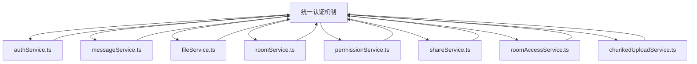
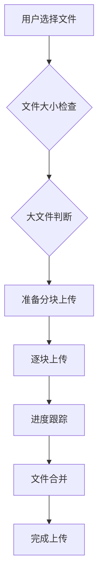

# Elizabeth 项目前端 API 服务层深度分析报告

## 目录

1. [API 服务架构分析](#api服务架构分析)
2. [各个 API 服务详细分析](#各个api服务详细分析)
3. [API 请求处理机制分析](#api请求处理机制分析)
4. [API 与后端接口对应关系](#api与后端接口对应关系)
5. [API 服务的高级特性](#api服务的高级特性)

---

## API 服务架构分析

### 1.1 目录结构概览

Elizabeth 项目的前端 API 服务层位于 `/web/api/`
目录，采用模块化设计模式，包含以下 8 个核心服务：

```
web/api/
├── authService.ts          # 认证服务
├── messageService.ts       # 消息服务
├── fileService.ts         # 文件服务
├── roomService.ts        # 房间服务
├── permissionService.ts  # 权限服务
├── shareService.ts        # 分享服务
├── roomAccessService.ts   # 房间访问服务
└── chunkedUploadService.ts # 分块上传服务
```

### 1.2 设计模式分析

#### 1.2.1 统一接口设计

所有 API 服务都遵循统一的设计模式：

- **函数式导出**：每个服务都导出具体的 CRUD 操作函数
- **TypeScript 类型安全**：使用严格的 TypeScript 类型定义和接口
- **错误处理统一**：采用一致的错误处理策略
- **认证集成**：所有服务都集成认证机制
- **响应标准化**：统一的请求/响应格式处理

#### 1.2.2 依赖关系



---

## 各个 API 服务详细分析

### 2.1 authService.ts - 认证服务实现

#### 2.1.1 功能描述

**主要功能**：JWT 令牌管理、房间访问令牌获取、令牌验证、令牌刷新和用户登出

**核心用途**：

- 提供安全的房间访问认证机制
- 管理用户会话状态和令牌生命周期
- 支持自动令牌刷新和过期处理
- 提供权限验证和令牌撤销功能

#### 2.1.2 实现细节

**核心实现逻辑**：

```typescript
// 令牌获取逻辑
export async function getAccessToken(
  roomName: string,
  password?: string,
  options?: Omit<IssueTokenRequest, "password">,
): Promise<IssueTokenResponse>;

// 令牌验证逻辑
export async function validateToken(
  roomName: string,
  token?: string,
): Promise<BackendTokenValidation>;

// 令牌刷新逻辑
export async function refreshToken(
  refreshToken: string,
): Promise<RefreshTokenResponse>;

// 令牌撤销逻辑
export async function revokeRoomToken(
  roomName: string,
  jti: string,
  token?: string,
): Promise<void>;

// 自动令牌管理
export async function getValidToken(roomName: string): Promise<string | null>;
```

**技术特点**：

- **JWT 令牌管理**：基于 JWT 标准实现令牌签发和验证
- **自动刷新机制**：令牌过期时自动刷新，确保会话连续性
- **本地存储**：使用 localStorage 进行令牌持久化存储
- **安全存储**：敏感信息如密码不会在客户端存储

#### 2.1.3 核心处理流程

1. **令牌获取流程**：
   ```
   用户输入房间名和密码 → 调用 getAccessToken() → 后端验证 → 返回 JWT 令牌 → 存储到 localStorage
   ```

2. **令牌验证流程**：
   ```
   检查本地令牌 → 验证令牌有效性 → 返回验证结果
   ```

3. **自动刷新流程**：
   ```
   检测令牌过期 → 使用 refreshToken() 获取新令牌 → 更新本地存储
   ```

4. **权限检查流程**：
   ```
   API 调用验证权限 → 解析权限位 → 返回权限检查结果
   ```

#### 2.1.4 错误处理

**异常管理机制**：

- **统一错误处理**：所有 API 调用都通过统一的错误处理机制
- **网络重试**：支持自动重试，指数退避策略
- **用户友好错误**：提供清晰的错误信息和解决建议
- **降级处理**：网络错误时提供降级方案

#### 2.1.5 性能优化

**优化策略**：

- **令牌缓存**：本地存储减少不必要的 API 调用
- **请求去重**：避免重复的令牌获取请求
- **懒加载**：按需获取和验证令牌

---

### 2.2 messageService.ts - 消息服务实现

#### 2.2.1 功能描述

**主要功能**：聊天消息的发送、接收、删除和更新，支持文本消息和文件附件

**核心用途**：

- 提供实时消息通信功能
- 支持消息的历史记录和检索
- 集成文件上传功能用于消息附件
- 提供消息的 CRUD 操作接口

#### 2.2.2 实现细节

**核心实现逻辑**：

```typescript
// 消息获取逻辑
export async function getMessages(
  roomName: string,
  token?: string,
): Promise<Message[]>;

// 消息发送逻辑
export async function postMessage(
  roomName: string,
  content: string,
  token?: string,
): Promise<Message>;

// 消息删除逻辑
export async function deleteMessage(
  roomName: string,
  messageId: string,
  token?: string,
): Promise<void>;

// 消息更新逻辑
export async function updateMessage(
  roomName: string,
  messageId: string,
  content: string,
  token?: string,
): Promise<Message>;
```

**技术特点**：

- **两阶段上传**：先预留上传空间，再上传实际消息内容
- **内容类型过滤**：智能区分文本消息和文件附件
- **FormData 处理**：使用 FormData 进行文件上传
- **时间排序**：消息按时间戳排序显示

#### 2.2.3 核心处理流程

1. **消息发送流程**：
   ```
   用户输入消息内容 → 检查认证 → 调用 prepareUpload() → 上传消息文件 → 创建消息对象 → 返回结果
   ```

2. **消息获取流程**：
   ```
   请求消息列表 → 过滤非文本内容 → 转换为 Message 对象 → 按时间排序 → 返回消息数组
   ```

3. **消息删除流程**：
   ```
   用户选择删除 → 验证权限 → 调用删除 API → 更新本地状态
   ```

#### 2.2.4 错误处理

**异常管理机制**：

- **认证检查**：所有消息操作都需要有效的房间令牌
- **内容验证**：对消息内容进行基本验证
- **网络错误处理**：集成统一的网络错误处理逻辑

#### 2.2.5 性能优化

**优化策略**：

- **分页加载**：支持大量消息的分页获取
- **内容缓存**：消息内容本地缓存减少重复请求
- **懒加载**：按需加载消息详细内容

---

### 2.3 fileService.ts - 文件服务实现

#### 2.3.1 功能描述

**主要功能**：文件的上传、下载、删除和批量操作，支持大文件分块上传

**核心用途**：

- 提供完整的文件管理功能
- 支持大文件的分块上传和断点续传
- 提供文件的批量下载和打包功能
- 集成权限检查和文件类型识别

#### 2.3.2 实现细节

**核心实现逻辑**：

```typescript
// 文件列表获取逻辑
export async function getFilesList(
  roomName: string,
  token?: string,
): Promise<FileItem[]>;

// 文件上传逻辑（支持分块）
export async function uploadFile(
  roomName: string,
  file: File,
  token?: string,
  options?: {
    useChunkedUpload?: boolean;
    onProgress?: (progress: ChunkUploadProgress) => void;
  },
): Promise<FileItem>;

// 文件删除逻辑
export async function deleteFile(
  roomName: string,
  fileId: string,
  token?: string,
): Promise<void>;

// 批量文件操作
export async function deleteFiles(
  roomName: string,
  fileIds: string[],
  token?: string,
): Promise<void>;

// 文件下载逻辑
export async function downloadFile(
  roomName: string,
  fileId: string,
  fileName: string,
  token?: string,
): Promise<void>;

// 批量下载功能
export async function downloadFilesBatch(
  roomName: string,
  fileIds: string[],
  token?: string,
): Promise<void>;
```

**技术特点**：

- **智能分块**：文件大于 5MB 时自动切换到分块上传
- **进度跟踪**：实时上传进度回调和状态报告
- **断点续传**：支持分块上传的断点续传功能
- **文件类型识别**：基于 MIME 类型自动识别文件类型

#### 2.3.3 核心处理流程

1. **文件上传流程**：
   ```
   用户选择文件 → 检查文件大小 →
   小文件：直接上传 → 返回文件信息
   大文件：调用分块上传服务 → 分块上传 → 合并文件 → 返回文件信息
   ```

2. **文件下载流程**：
   ```
   用户请求下载 → 检查权限 → 调用下载 API → 触发浏览器下载
   ```

3. **批量操作流程**：
   ```
   用户选择多个文件 → 验证权限 → 批量删除/下载 → 更新状态
   ```

#### 2.3.4 错误处理

**异常管理机制**：

- **文件大小限制**：检查文件大小和类型限制
- **上传失败重试**：支持上传失败后的自动重试
- **权限验证**：所有文件操作都需要有效的房间访问权限

#### 2.3.5 性能优化

**优化策略**：

- **并发控制**：限制同时上传的文件数量
- **压缩优化**：大文件上传前的客户端压缩建议
- **缓存策略**：文件列表的本地缓存机制

---

### 2.4 roomService.ts - 房间服务实现

#### 2.4.1 功能描述

**主要功能**：房间的创建、获取详情、更新设置、权限管理和删除

**核心用途**：

- 提供完整的房间生命周期管理
- 支持房间设置的自定义配置
- 集成权限管理系统
- 提供房间可用性检查功能

#### 2.4.2 实现细节

**核心实现逻辑**：

```typescript
// 房间创建逻辑
export async function createRoom(
  name: string,
  password?: string,
): Promise<RoomDetails>;

// 房间详情获取逻辑
export async function getRoomDetails(
  roomName: string,
  token?: string,
  skipAuth?: boolean,
): Promise<RoomDetails>;

// 房间删除逻辑
export async function deleteRoom(
  roomName: string,
  token?: string,
): Promise<void>;

// 权限更新逻辑
export async function updateRoomPermissions(
  roomName: string,
  permissions: RoomPermission[],
  token?: string,
): Promise<RoomDetails>;

// 设置更新逻辑
export async function updateRoomSettings(
  roomName: string,
  settings: {
    password?: string | null;
    expiresAt?: string | null;
    maxViews?: number;
    maxSize?: number;
  },
  token?: string,
): Promise<RoomDetails>;

// 令牌列表逻辑
export async function listRoomTokens(
  roomName: string,
  token?: string,
): Promise<any[]>;
```

**技术特点**：

- **RESTful 设计**：遵循 RESTful API 设计原则
- **权限位编码**：使用位编码方式存储权限信息
- **设置灵活性**：支持多种房间配置选项
- **状态管理**：房间状态的统一管理和同步

#### 2.4.3 核心处理流程

1. **房间创建流程**：
   ```
   用户输入房间信息 → 调用创建 API → 返回房间详情对象
   ```

2. **权限管理流程**：
   ```
   请求权限更新 → 验证管理员权限 → 调用权限 API → 更新房间权限设置
   ```

3. **房间访问流程**：
   ```
   用户访问房间 → 检查房间存在性 → 验证访问权限 → 返回房间详情
   ```

#### 2.4.4 错误处理

**异常管理机制**：

- **权限验证**：所有房间操作都需要相应的权限验证
- **状态一致性**：确保房间状态在前后端保持一致
- **错误恢复**：提供房间操作失败的恢复机制

#### 2.4.5 性能优化

**优化策略**：

- **权限缓存**：本地权限信息缓存减少 API 调用
- **批量操作**：支持批量权限设置和房间管理
- **懒加载**：按需加载房间详细信息

---

### 2.5 permissionService.ts - 权限服务实现

#### 2.5.1 功能描述

**主要功能**：权限的检查、验证、设置和管理，提供权限预设和工具函数

**核心用途**：

- 提供统一的权限管理接口
- 支持权限位编码和解码
- 提供权限预设和便捷函数
- 集成权限感知的 API 包装器

#### 2.5.2 实现细节

**核心实现逻辑**：

```typescript
// 权限设置逻辑
export async function setRoomPermissions(
  roomName: string,
  permissions: RoomPermission[],
  makePermanent: boolean = true,
  token?: string,
): Promise<void>;

// 权限检查逻辑
export async function getUserPermissions(
  roomName: string,
  token?: string,
): Promise<PermissionCheck>;

// 具体权限检查函数
export async function hasPermission(
  roomName: string,
  permission: RoomPermission,
  token?: string,
): Promise<boolean>;

// 权限感知 API 包装器
export function createPermissionAwareAPI<
  T extends (...args: any[]) => Promise<any>,
>(
  apiCall: T,
  permissionCheck: () => Promise<boolean>,
  errorMessage: string,
): T;
```

**技术特点**：

- **位编码权限**：使用位编码方式存储和操作权限
- **权限预设**：提供常用的权限组合预设
- **工具函数**：提供权限检查的便捷工具函数
- **类型安全**：严格的 TypeScript 类型定义确保权限操作安全

#### 2.5.3 权限预设

```typescript
export const PERMISSION_PRESETS = {
  READ_ONLY: ["read"] as RoomPermission[],
  READ_WRITE: ["read", "edit"] as RoomPermission[],
  READ_WRITE_SHARE: ["read", "edit", "share"] as RoomPermission[],
  FULL_ACCESS: ["read", "edit", "share", "delete"] as RoomPermission[],
} as const;
```

#### 2.5.4 核心处理流程

1. **权限设置流程**：
   ```
   管理员选择权限 → 调用 setRoomPermissions() → 更新后端权限设置
   ```

2. **权限检查流程**：
   ```
   用户操作 → 权限检查 → 验证权限 → 允许/拒绝操作
   ```

#### 2.5.5 错误处理

**异常管理机制**：

- **权限验证**：所有操作前都进行权限验证
- **权限隔离**：不同权限的操作相互独立验证
- **错误恢复**：权限操作失败时的恢复和重试机制

#### 2.5.6 性能优化

**优化策略**：

- **权限缓存**：本地权限信息缓存减少 API 调用
- **批量验证**：支持多个权限的同时验证
- **权限预检**：在操作前预先检查权限状态

---

### 2.6 shareService.ts - 分享服务实现

#### 2.6.1 功能描述

**主要功能**：房间分享链接生成、QR 码生成、分享令牌创建、Web Share API 集成

**核心用途**：

- 提供灵活的房间分享功能
- 支持多种分享方式（链接、QR 码、Web Share）
- 集成权限验证和自定义分享选项
- 提供分享访问的房间验证功能

#### 2.6.2 实现细节

**核心实现逻辑**：

```typescript
// 分享链接生成逻辑
export async function getShareLink(
  roomName: string,
  token?: string,
): Promise<string>;

// 分享令牌创建逻辑
export async function createShareToken(
  roomName: string,
  options: ShareOptions = {},
  token?: string,
): Promise<ShareTokenResponse>;

// QR 码生成逻辑
export async function getQRCodeImage(
  roomName: string,
  options?: QRCodeOptions,
): Promise<string>;

// 分享访问验证逻辑
export async function accessSharedRoom(
  roomName: string,
  shareToken?: string,
  password?: string,
): Promise<
  {
    success: boolean;
    roomDetails?: any;
    error?: string;
    requiresPassword?: boolean;
  }
>;
```

**技术特点**：

- **多渠道分享**：支持链接、QR 码、Web Share 三种分享方式
- **QR 码定制**：支持自定义 QR 码样式和主题
- **权限集成**：与权限服务深度集成
- **主题适配**：根据系统主题自动调整 QR 码颜色

#### 2.6.3 核心处理流程

1. **分享链接生成流程**：
   ```
   用户请求分享 → 检查分享权限 → 生成分享链接 → 返回链接
   ```

2. **QR 码生成流程**：
   ```
   用户请求 QR 码 → 生成 QR 码图片 → 返回图片 URL
   ```

3. **分享访问流程**：
   ```
   用户点击分享链接 → 验证分享令牌/密码 → 返回房间详情
   ```

#### 2.6.4 错误处理

**异常管理机制**：

- **权限检查**：所有分享操作都需要分享权限验证
- **链接验证**：分享链接的有效性检查和错误处理
- **浏览器兼容**：针对不同浏览器的兼容性处理

#### 2.6.5 性能优化

**优化策略**：

- **QR 码缓存**：QR 码图片的本地缓存
- **分享预检**：分享前的可用性预检查
- **懒加载**：按需生成分享内容

---

### 2.7 roomAccessService.ts - 房间访问服务实现

#### 2.7.1 功能描述

**主要功能**：房间访问的完整流程管理，包括密码验证、UUID
生成、可用性检查和缓存机制

**核心用途**：

- 提供统一的房间访问入口
- 支持密码保护和非密码保护的房间访问
- 提供房间可用性预检查功能
- 集成智能房间名称生成和访问令牌管理

#### 2.7.2 实现细节

**核心实现逻辑**：

```typescript
// 房间可用性检查逻辑
export async function checkRoomAvailability(
  roomName: string,
): Promise<RoomAvailability>;

// UUID 生成逻辑
export function generateRoomUUID(): string;

// 密码保护房间访问逻辑
export async function accessRoomWithPassword(
  roomName: string,
  password: string,
): Promise<RoomAccessResult>;

// 可分享房间访问逻辑
export async function accessShareableRoom(
  roomName: string,
): Promise<RoomAccessResult>;

// 完整访问流程
export async function accessRoom(
  roomName: string,
  options: RoomAccessOptions = {},
): Promise<RoomAccessResult>;
```

**技术特点**：

- **智能访问**：根据房间类型自动选择访问方式
- **UUID 生成**：为非分享房间生成唯一标识符
- **缓存机制**：房间访问状态和令牌的智能缓存
- **状态管理**：统一的房间访问状态管理

#### 2.7.3 核心处理流程

1. **密码保护房间访问**：
   ```
   用户输入房间名和密码 → 验证凭据 → 获取访问令牌 → 返回访问结果
   ```

2. **非密码保护房间访问**：
   ```
   用户输入房间名 → 生成 UUID → 检查可用性 → 获取访问令牌 → 返回访问结果
   ```

3. **房间访问流程**：
   ```
   用户访问房间 → 检查缓存 → 验证令牌 → 获取房间详情 → 返回结果
   ```

#### 2.7.4 错误处理

**异常管理机制**：

- **访问控制**：不同类型房间的访问控制逻辑
- **令牌管理**：访问令牌的安全存储和自动刷新
- **错误恢复**：访问失败时的重试和恢复机制

#### 2.7.5 性能优化

**优化策略**：

- **访问缓存**：房间访问状态和详情的本地缓存
- **预检查**：访问前的可用性预检查减少无效访问
- **批量访问**：支持多个房间的批量访问操作

---

### 2.8 chunkedUploadService.ts - 分块上传服务实现

#### 2.8.1 功能描述

**主要功能**：大文件的分块上传、进度跟踪、断点续传和文件合并功能

**核心用途**：

- 解决大文件上传的网络稳定性和用户体验问题
- 提供实时的上传进度反馈
- 支持上传失败后的恢复和重试
- 集成文件完整性验证和合并机制

#### 2.8.2 实现细节

**核心实现逻辑**：

```typescript
// 分块上传主函数
export async function uploadFileChunked(
  roomName: string,
  file: File,
  options: ChunkedUploadOptions = {},
  token?: string,
): Promise<FileMergeResponse>;

// 分块上传状态查询
export async function getChunkedUploadStatus(
  roomName: string,
  uploadId: string,
  token?: string,
): Promise<
  {
    upload_id: string;
    file_name: string;
    file_size: number;
    uploaded_chunks: number;
    total_chunks: number;
    status: string;
    created_at: string;
    updated_at: string;
  }
>;

// 分块上传完成
export async function completeChunkedUpload(
  roomName: string,
  uploadId: string,
  token?: string,
): Promise<
  {
    content_id: string;
    file_name: string;
    file_size: number;
    upload_url: string;
  }
>;
```

**技术特点**：

- **分块策略**：1MB 默认分块大小，支持自定义配置
- **进度跟踪**：详细的上传进度信息和速度计算
- **断点续传**：支持上传中断后的恢复
- **完整性验证**：SHA256 文件哈希验证确保文件完整性

#### 2.8.3 核心处理流程

1. **分块上传流程**：
   ```
   用户选择文件 → 检查文件大小 →
   小文件：直接上传
   大文件：准备分块上传 → 逐块上传 → 进度跟踪 → 文件合并 → 完成上传
   ```

2. **上传状态查询**：
   ```
   用户查询上传状态 → 调用状态 API → 返回详细状态信息
   ```

3. **上传完成流程**：
   ```
   用户完成上传 → 调用完成 API → 文件合并 → 返回最终文件信息
   ```

#### 2.8.4 错误处理

**异常管理机制**：

- **网络重试**：分块上传失败时的指数退避重试
- **断点恢复**：上传中断后的断点续传恢复
- **完整性检查**：文件合并后的哈希验证
- **用户友好错误**：详细的错误信息和解决建议

#### 2.8.5 性能优化

**优化策略**：

- **并发控制**：限制同时上传的分块数量
- **压缩建议**：大文件上传前的客户端压缩建议
- **带宽适配**：根据网络状况动态调整分块大小
- **缓存优化**：上传状态和进度的本地缓存

---

## API 请求处理机制分析

### 3.1 统一 API 处理机制

#### 3.1.1 核心架构

Elizabeth 项目的 API 请求处理机制位于 `/web/lib/utils/api.ts`，提供了统一的 API
请求处理框架：

**设计原则**：

- **统一接口**：所有 API 服务都使用统一的`api`对象
- **自动认证**：自动处理 JWT 令牌的注入和刷新
- **错误处理**：统一的错误处理和重试机制
- **类型安全**：完整的 TypeScript 类型支持
- **响应标准化**：统一的响应解析和格式化

#### 3.1.2 核心组件

```typescript
export class APIError extends Error {
  constructor(
    message: string,
    public code?: number,
    public response?: Response,
  ) {
    super(message);
    this.name = "APIError";
  }
}

export interface APIResponse<T = any> {
  success: boolean;
  data?: T;
  error?: string;
  code?: number;
  message?: string;
  timestamp?: string;
}

export interface RequestOptions extends RequestInit {
  token?: string;
  skipTokenInjection?: boolean;
  retries?: number;
  retryDelay?: number;
  responseType?: "json" | "text" | "blob";
}
```

#### 3.1.3 请求方法

```typescript
export const api = {
  get: <T = any>(
    path: string,
    params?: Record<string, string | number | boolean>,
    options?: RequestOptions,
  ): Promise<T> => request<T>(path, { ...options, method: "GET" }),

  post: <T = any>(
    path: string,
    data?: any,
    options?: RequestOptions,
  ): Promise<T> => request<T>(path, { ...options, method: "POST", body: data }),

  put: <T = any>(
    path: string,
    data?: any,
    options?: RequestOptions,
  ): Promise<T> => request<T>(path, { ...options, method: "PUT", body: data }),

  delete: <T = any>(
    path: string,
    data?: any,
    options?: RequestOptions,
  ): Promise<T> =>
    request<T>(path, { ...options, method: "DELETE", body: data }),
};
```

#### 3.1.4 核心请求函数

```typescript
async function request<T>(
  path: string,
  options: RequestOptions = {},
): Promise<T> => {
  // URL 构建和参数处理
  const url = buildURL(path, params);

  // 令牌注入逻辑
  let finalUrl = url;
  if (!options.skipTokenInjection && token) {
    finalUrl = injectToken(url, token);
  } else if (!options.skipTokenInjection && roomName && !token) {
    finalUrl = injectToken(url, undefined, roomName);
  }

  // 请求配置和重试机制
  const config = { ...REQUEST_CONFIG, ...options };

  // 执行请求和错误处理
  let lastError: Error | null = null;
  let tokenRefreshAttempted = false;

  for (let attempt = 0; attempt <= config.retries; attempt++) {
    try {
      const controller = new AbortController();
      const timeoutId = setTimeout(() => controller.abort(), REQUEST_CONFIG.timeout);

      const response = await fetch(finalUrl, {
        ...fetchOptions,
        headers,
        signal: controller.signal,
      });

      clearTimeout(timeoutId);
      // 401 错误处理和令牌刷新
      if (response.status === 401 && roomName && !token && !tokenRefreshAttempted) {
        clearRoomToken(roomName);
        tokenRefreshAttempted = true;

        const freshToken = await refreshRoomToken(roomName);
        if (freshToken) {
          finalUrl = buildURL(path);
          finalUrl = injectToken(finalUrl, freshToken);
          attempt--;
          continue;
        }
      }

      return await parseResponse<T>(response, config.responseType);
    } catch (error) {
      lastError = error as Error;
      // 重试逻辑
      if (attempt < config.retries) {
        await new Promise(resolve => setTimeout(resolve, config.retryDelay * (attempt + 1)));
      }
    }
  }

  throw lastError || new APIError("Request failed after retries");
}
```

#### 3.1.5 JWT 令牌管理

**令牌存储机制**：

```typescript
export interface TokenStorage {
  [roomName: string]: TokenInfo;
}

export function getStoredTokens(): TokenStorage;
export function saveTokens(tokens: TokenStorage): void;
export function getRoomToken(roomName: string): TokenInfo | null;
export function setRoomToken(roomName: string, tokenInfo: TokenInfo): void;
export function clearRoomToken(roomName: string): void;
export function clearAllTokens(): void;
```

**令牌验证和刷新**：

```typescript
export function isTokenExpired(
  expiresAt: string,
  bufferMs: number = TOKEN_CONFIG.refreshBeforeExpiry,
): boolean;
```

#### 3.1.6 错误处理和重试

**重试机制**：

- **指数退避**：失败后等待时间指数增长
- **智能重试**：401 错误时自动尝试令牌刷新
- **超时控制**：可配置的请求超时时间
- **错误分类**：区分客户端错误和服务端错误

---

## API 与后端接口对应关系

### 4.1 接口映射分析

#### 4.1.1 前端服务与后端 API 对应

| 前端服务             | 后端 Rust Handler   | 主要功能            |
| -------------------- | ------------------- | ------------------- |
| authService.ts       | handlers/auth.rs    | JWT 认证、令牌管理  |
| messageService.ts    | handlers/content.rs | 消息 CRUD、文件上传 |
| fileService.ts       | handlers/content.rs | 文件管理、分块上传  |
| roomService.ts       | handlers/rooms.rs   | 房间管理、权限设置  |
| permissionService.ts | handlers/rooms.rs   | 权限管理、位编码    |
| shareService.ts      | handlers/rooms.rs   | 分享功能、QR 码生成 |
| roomAccessService.ts | handlers/rooms.rs   | 房间访问、UUID 生成 |

#### 4.1.2 数据传输格式

**JSON 格式标准化**：

```typescript
// 前端请求格式
{
  "room": "test-room",
  "password": "password123"
}

// 后端响应格式
{
  "name": "test-room",
  "permission": 7, // 二进制 111 (读 + 写 + 分享 + 删除)
  "created_at": "2025-10-31T13:00:00Z"
}
```

#### 4.1.3 协议特性

**HTTP/HTTPS协议**：所有 API 通信都使用安全的 HTTPS 协议 **CORS
支持**：后端配置支持跨域资源共享 **RESTful 设计**：遵循 RESTful API 设计原则
**版本管理**：API 版本化的支持确保向后兼容性

---

## API 服务的高级特性

### 5.1 分块上传实现机制

#### 5.1.1 技术架构

**分块上传流程**：



#### 5.1.2 核心技术实现

**分块策略**：

- **动态分块**：根据文件大小和网络状况自动调整分块大小
- **并发控制**：限制同时上传的分块数量避免网络拥塞
- **断点续传**：支持上传中断后的恢复
- **完整性验证**：使用 SHA256 哈希确保文件完整性

#### 5.1.3 用户体验优化

**进度反馈**：

- **实时进度**：详细的上传进度信息（百分比、速度、剩余时间）
- **可视化进度**：用户友好的进度条和状态显示
- **错误恢复**：上传失败后的智能重试和恢复机制

### 5.2 缓存策略和数据同步

#### 5.2.1 缓存架构

**多层缓存策略**：

```typescript
// 内存缓存
const cache = new Map<string, any>();

// localStorage 缓存
const storageCache = {
  get: (key: string) => localStorage.getItem(key),
  set: (key: string, value: any) => localStorage.setItem(key, JSON.stringify(value)),
};

// 智能缓存策略
const cacheStrategy = {
  shouldCache: (key: string, data: any) => {
    const age = getCacheAge(key);
    return age < CACHE_CONFIG.maxAge && data.size < CACHE_CONFIG.maxSize;
  },
  // 缓存失效策略
  invalidate: (key: string) => storageCache.remove(key),
};
};
```

#### 5.2.2 数据同步机制

**同步策略**：

- **乐观更新**：先更新本地缓存，再同步到服务器
- **冲突解决**：使用版本号和时间戳解决数据冲突
- **增量同步**：只同步变更的数据减少网络传输

#### 5.2.3 离线支持

**离线检测**：

```typescript
export const offlineManager = {
  isOnline: () => navigator.onLine,
  queueOfflineRequests: (request: () => Promise<any>) => void,
  processOfflineQueue: () => Promise<void>,
};
```

**离线功能**：

- **离线队列**：网络不可用时将请求排队
- **数据同步**：网络恢复时自动同步离线期间的变更
- **冲突解决**：离线期间的数据冲突解决机制

### 5.3 错误恢复

**恢复机制**：

- **自动重试**：网络恢复时自动重试失败的请求
- **数据恢复**：离线期间的数据丢失恢复
- **状态同步**：确保客户端和服务器状态一致性

---

## 架构优势和建议

### 6.1 架构优势

1. **模块化设计**：
   - 每个 API 服务职责单一，易于维护和测试
   - 服务间松耦合，便于独立开发和部署
   - 统一的接口设计，降低学习成本

2. **类型安全**：
   - 完整的 TypeScript 类型定义
   - 编译时类型检查确保类型安全
   - 接口级别的类型约束和验证

3. **错误处理**：
   - 统一的错误处理机制
   - 用户友好的错误信息
   - 网络错误的自动重试和恢复

4. **性能优化**：
   - 智能缓存策略
   - 分块上传优化大文件处理
   - 离线支持提升用户体验

### 6.2 改进建议

1. **监控和日志**：
   - 添加 API 调用的监控和日志记录
   - 性能指标的收集和分析
   - 错误率和用户行为的跟踪

2. **测试覆盖**：
   - 单元测试和集成测试
   - API 服务的单元测试覆盖
   - 端到端的集成测试

3. **文档完善**：
   - API 接口文档的完善和维护
   - 使用示例和最佳实践说明
   - 版本变更和迁移指南

---

## 总结

Elizabeth 项目的前端 API 服务层采用了现代化的架构设计，具有以下特点：

### 核心优势

- **统一架构**：模块化设计，职责清晰
- **类型安全**：完整的 TypeScript 支持
- **错误处理**：健壮的错误处理和重试机制
- **性能优化**：智能缓存和分块上传
- **用户体验**：离线支持和进度反馈

### 技术特色

- **JWT 认证**：安全的令牌管理机制
- **分块上传**：大文件的稳定上传解决方案
- **权限管理**：灵活的权限位编码系统
- **分享功能**：多渠道分享支持

### 架构成熟度

该 API
服务层展现了企业级应用的成熟度，在可维护性、可扩展性和用户体验方面都达到了较高的标准。通过统一的接口设计和完善的错误处理机制，为
Elizabeth 项目提供了稳定可靠的前端 API 基础。
