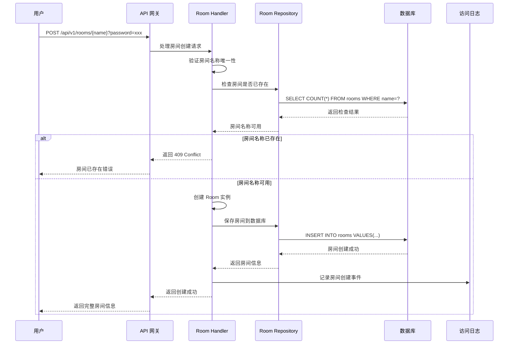
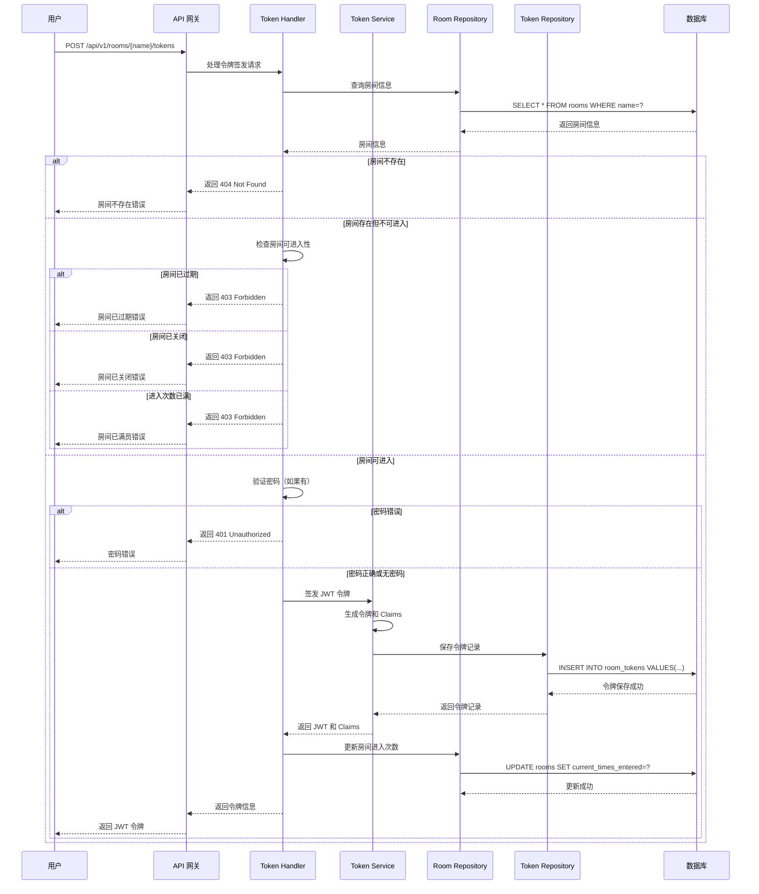
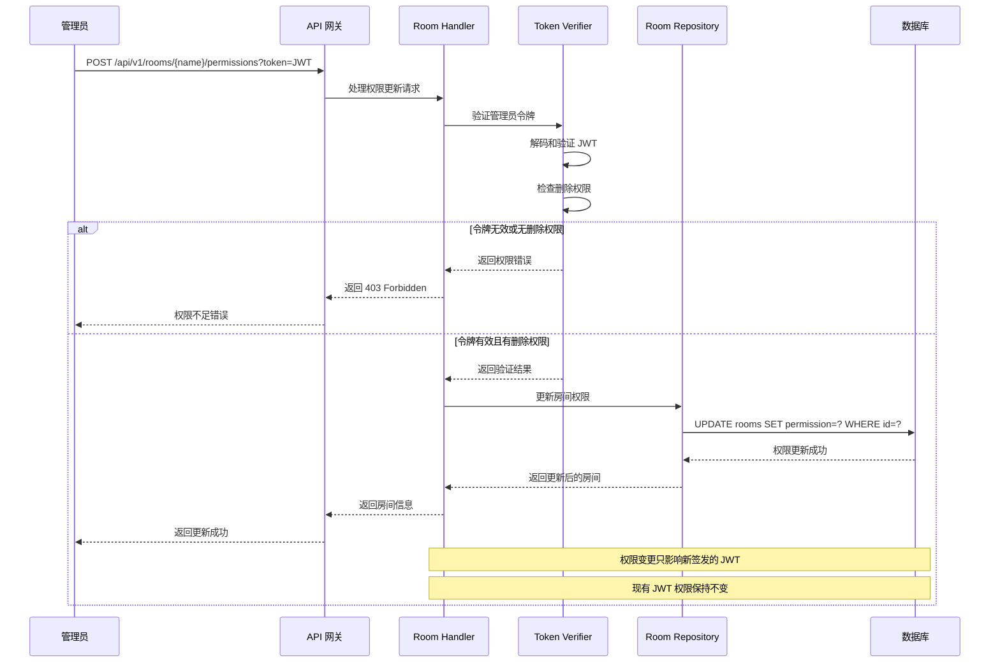
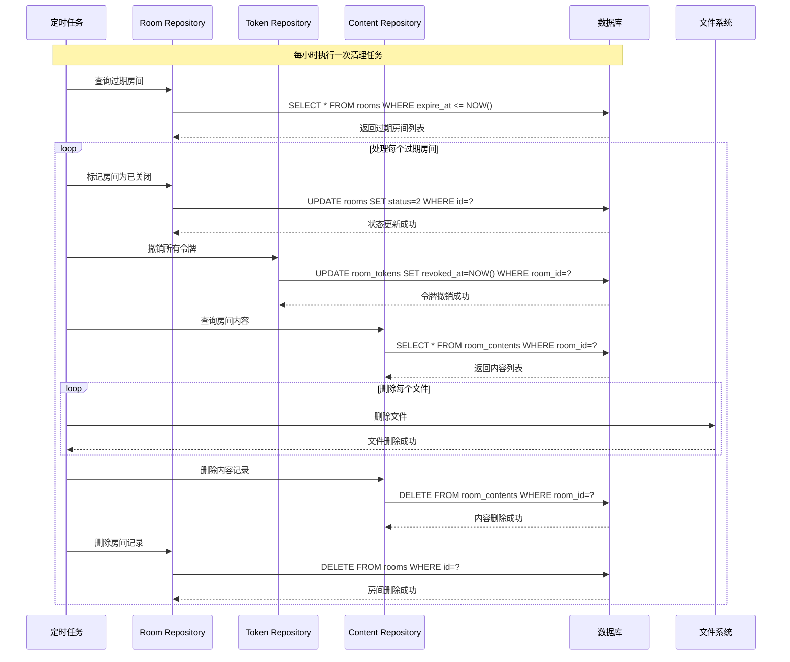
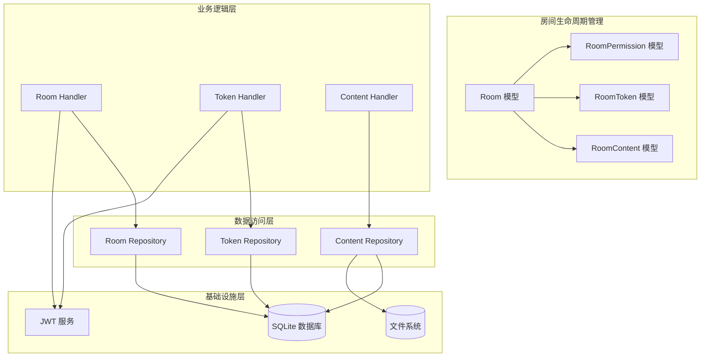
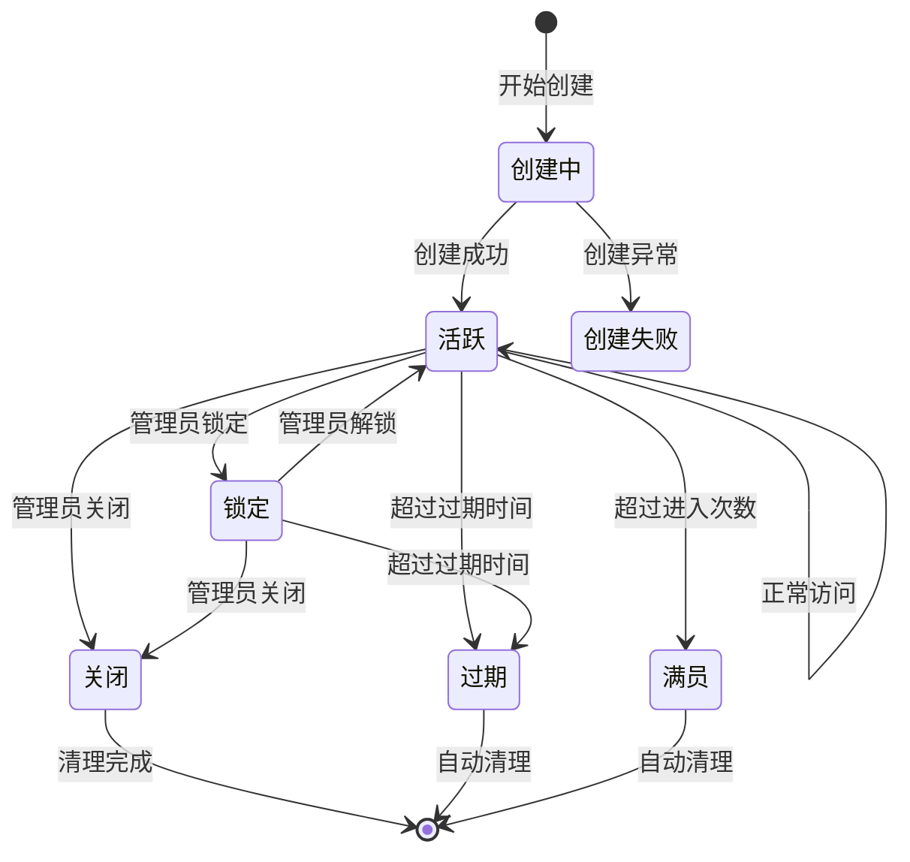

# System-1: 房间生命周期管理系统

## 1. 系统概述

房间生命周期管理系统是 Elizabeth
文件分享平台的核心子系统，负责管理房间从创建到销毁的完整生命周期。系统采用"房间为中心"的设计理念，通过
Room、RoomToken、RoomPermission 和 RoomContent
四个核心模型的协同工作，实现无用户系统的临时文件分享功能。该系统确保房间的安全访问、权限控制、容量管理和自动清理，为用户提供一个安全、可控、临时的文件共享环境。

系统的核心价值在于将传统用户系统的复杂性转移到房间生命周期管理上，通过房间的创建、访问、权限变更和过期清理等机制，实现细粒度的访问控制和资源管理。每个房间都有独立的生命周期，支持密码保护、访问次数限制、容量限制和过期时间控制，确保分享的安全性和临时性。

## 2. 核心业务流程

### 2.1 房间创建流程



房间创建流程的关键步骤：

1. **名称唯一性验证**：系统首先验证房间名称在全局范围内的唯一性
2. **房间实例创建**：使用
   [`Room::new()`](crates/board/src/models/room/mod.rs:52) 创建房间实例
3. **权限初始化**：新房间默认获得全部权限（`RoomPermission::new().with_all()`）
4. **数据库持久化**：通过
   [`SqliteRoomRepository`](crates/board/src/repository/room_repository.rs)
   保存房间信息
5. **审计日志记录**：记录房间创建事件，包含创建时间、IP 地址等信息

### 2.2 房间访问流程



房间访问流程的关键验证点：

1. **房间存在性检查**：验证房间是否存在于系统中
2. **可进入性验证**：通过
   [`Room::can_enter()`](crates/board/src/models/room/mod.rs:83) 检查房间状态
3. **密码验证**：如果房间设置了密码，必须提供正确密码
4. **令牌签发**：使用
   [`TokenService::issue()`](crates/board/src/services/token.rs:61) 生成 JWT
5. **访问计数更新**：成功访问后更新房间的进入次数

### 2.3 权限变更流程



权限变更流程的特点：

1. **权限验证**：只有持有删除权限的用户才能修改房间权限
2. **原子性更新**：权限变更作为原子操作执行
3. **向后兼容**：现有 JWT 的权限不受影响，只有新签发的 JWT 使用新权限
4. **审计记录**：所有权限变更都会被记录到访问日志中

### 2.4 房间过期和清理流程



房间清理流程的注意事项：

1. **级联删除**：房间删除会级联删除所有关联的内容和令牌
2. **文件系统清理**：物理文件也需要从存储系统中删除
3. **事务安全**：清理操作在事务中执行，确保数据一致性
4. **错误恢复**：清理过程中的错误会被记录，不影响其他房间的清理

## 3. 跨模型交互

### 3.1 Room 模型与其他模型的交互

Room 模型作为系统的核心，与其他模型存在密切的交互关系：

**与 RoomToken 模型的交互**：

- 房间创建时，通过 [`Room::can_enter()`](crates/board/src/models/room/mod.rs:83)
  验证可进入性
- 令牌签发时，房间的 `permission` 字段被编码到 JWT Claims 中
- 房间状态变更影响新令牌的签发，但不影响现有令牌

**与 RoomPermission 模型的交互**：

- 房间权限通过 `RoomPermission` 位标志管理
- 权限变更通过
  [`UpdateRoomPermissionRequest`](crates/board/src/handlers/rooms.rs:349) 处理
- 权限验证在每次操作时进行，确保用户具有相应的操作权限

**与 RoomContent 模型的交互**：

- 房间的 `max_size` 和 `current_size` 字段控制内容上传
- 通过 [`Room::can_add_content()`](crates/board/src/models/room/mod.rs:89)
  验证容量限制
- 房间删除时，所有关联内容会被级联删除

### 3.2 数据流和依赖关系



**关键依赖关系**：

1. **Room → RoomPermission**：房间包含权限信息，权限验证依赖房间状态
2. **Room → RoomToken**：令牌签发依赖房间信息，令牌验证需要房间状态检查
3. **Room → RoomContent**：内容上传需要房间容量验证，房间删除影响内容清理
4. **RoomToken → JWTService**：令牌的生成、验证、撤销都依赖 JWT 服务

### 3.3 事务处理和数据一致性

系统采用 SQLite 的事务机制确保跨模型操作的原子性：

**房间创建事务**：

```sql
BEGIN TRANSACTION;
INSERT INTO rooms (name, password, status, permission, ...) VALUES (...);
-- 房间创建成功，事务提交
COMMIT;
```

**文件上传事务**：

```sql
BEGIN TRANSACTION;
-- 1. 检查房间容量
SELECT current_size, max_size FROM rooms WHERE id = ? FOR UPDATE;

-- 2. 更新房间容量
UPDATE rooms SET current_size = current_size + ? WHERE id = ?;

-- 3. 创建内容记录
INSERT INTO room_contents (room_id, content_type, path, size, ...) VALUES (...);

-- 4. 更新访问日志
INSERT INTO room_access_logs (room_id, action, ...) VALUES (...);

COMMIT;
```

## 4. 关键算法和逻辑

### 4.1 房间状态转换图



**状态转换逻辑**（[crates/board/src/models/room/mod.rs](crates/board/src/models/room/mod.rs)）：

```rust
impl Room {
    pub fn can_enter(&self) -> bool {
        !self.is_expired()
            && self.status != RoomStatus::Close
            && self.current_times_entered < self.max_times_entered
    }

    pub fn is_expired(&self) -> bool {
        if let Some(expire_at) = self.expire_at {
            expire_at < Utc::now().naive_utc()
        } else {
            false
        }
    }
}
```

### 4.2 权限验证逻辑

权限验证采用多层验证机制：

**第一层：房间级别验证**

```rust
// 检查房间是否允许该操作
pub fn can_add_content(&self, content_size: i64) -> bool {
    self.permission.can_edit() && self.current_size + content_size <= self.max_size
}
```

**第二层：JWT 令牌验证**

```rust
// 检查 JWT 中的权限
fn ensure_permission(
    claims: &RoomTokenClaims,
    room_allows: bool,
    action: ContentPermission,
) -> Result<(), HttpResponse> {
    if !room_allows {
        return Err(HttpResponse::Forbidden().message("Permission denied by room"));
    }

    let permission = claims.as_permission();
    let token_allows = match action {
        ContentPermission::View => permission.can_view(),
        ContentPermission::Edit => permission.can_edit(),
        ContentPermission::Delete => permission.can_delete(),
    };

    if !token_allows {
        return Err(HttpResponse::Forbidden().message("Permission denied by token"));
    }

    Ok(())
}
```

### 4.3 JWT 令牌生成算法

```rust
pub fn issue(&self, room: &Room) -> Result<(String, RoomTokenClaims)> {
    // 1. 验证房间状态
    if room.is_expired() {
        return Err(anyhow!("room already expired"));
    }

    let now = Utc::now();
    let mut exp = now + self.ttl;

    // 2. 计算过期时间（不超过房间过期时间）
    if let Some(room_expire) = room.expire_at {
        let room_expire = room_expire - chrono::Duration::seconds(self.leeway);
        if room_expire <= now.naive_utc() {
            return Err(anyhow!("room expires too soon to issue token"));
        }
        let room_expire_dt = chrono::DateTime::<Utc>::from_naive_utc_and_offset(room_expire, Utc);
        if exp > room_expire_dt {
            exp = room_expire_dt;
        }
    }

    // 3. 生成唯一标识
    let jti = Uuid::new_v4().to_string();

    // 4. 构建 Claims
    let claims = RoomTokenClaims {
        sub: format!("room:{}", room.id.unwrap_or_default()),
        room_id: room.id.ok_or_else(|| anyhow!("room id missing"))?,
        room_name: room.slug.clone(),
        permission: room.permission.bits(),
        max_size: room.max_size,
        exp: exp.timestamp(),
        iat: now.timestamp(),
        jti,
    };

    // 5. 签发令牌
    let token = jsonwebtoken::encode(
        &Header::new(Algorithm::HS256),
        &claims,
        &EncodingKey::from_secret(self.secret.as_bytes()),
    )?;

    Ok((token, claims))
}
```

## 5. 错误处理和恢复

### 5.1 常见错误场景

**房间创建失败**：

- **名称冲突**：返回 HTTP 409 Conflict
- **数据库错误**：返回 HTTP 500 Internal Server Error
- **参数验证失败**：返回 HTTP 400 Bad Request

**房间访问失败**：

- **房间不存在**：返回 HTTP 404 Not Found
- **房间已过期**：返回 HTTP 403 Forbidden
- **密码错误**：返回 HTTP 401 Unauthorized
- **进入次数已满**：返回 HTTP 403 Forbidden

**权限操作失败**：

- **令牌无效**：返回 HTTP 401 Unauthorized
- **权限不足**：返回 HTTP 403 Forbidden
- **房间不存在**：返回 HTTP 404 Not Found

### 5.2 错误恢复机制

**数据库事务回滚**：

```rust
pub async fn create_room_with_content(
    &self,
    room: &Room,
    content: &RoomContent,
) -> Result<(Room, RoomContent), anyhow::Error> {
    let mut tx = self.pool.begin().await?;

    // 1. 创建房间
    let room = self.create_room_tx(&mut tx, room).await?;

    // 2. 创建内容
    let content = self.create_content_tx(&mut tx, content).await?;

    // 3. 提交事务
    tx.commit().await?;

    Ok((room, content))
}
```

**文件系统清理**：

- 房间创建失败时，清理已创建的目录结构
- 内容上传失败时，删除已上传的文件
- 令牌撤销失败时，标记为需要手动清理

**重试机制**：

- 数据库连接失败时，自动重试 3 次
- 文件操作失败时，延迟重试
- 令牌验证失败时，检查时钟偏移

## 6. 性能和扩展性

### 6.1 性能优化策略

**数据库优化**：

```sql
-- 关键索引
CREATE INDEX idx_rooms_name ON rooms(name);
CREATE INDEX idx_rooms_status ON rooms(status);
CREATE INDEX idx_rooms_expire_at ON rooms(expire_at);
CREATE INDEX idx_room_tokens_room_id ON room_tokens(room_id);
CREATE INDEX idx_room_tokens_expires_at ON room_tokens(expires_at);
CREATE INDEX idx_room_contents_room_id ON room_contents(room_id);
```

**缓存策略**：

- 房间信息缓存：活跃房间信息缓存到内存中，减少数据库查询
- 令牌黑名单缓存：被撤销的令牌缓存到内存中，提高验证性能
- 权限信息缓存：频繁访问的权限信息缓存，减少重复计算

**并发控制**：

- 使用数据库行级锁防止并发修改冲突
- 令牌签发使用原子操作，避免重复签发
- 文件上传使用预留机制，防止容量超限

### 6.2 扩展性考虑

**水平扩展**：

- 数据库分片：按房间 ID 分片，支持多实例部署
- 文件存储分离：支持对象存储服务（如 S3、MinIO）
- 负载均衡：多实例部署，通过负载均衡器分发请求

**垂直扩展**：

- 异步处理：文件操作异步化，提高并发处理能力
- 连接池优化：数据库连接池参数调优
- 内存优化：减少内存分配，提高 GC 效率

## 7. 安全和合规

### 7.1 安全机制

**访问控制**：

- 多层权限验证：房间级别 + 令牌级别
- 最小权限原则：默认只给予必要权限
- 权限分离：不同操作需要不同权限

**数据保护**：

- 密码存储：当前为明文存储（P0 优先级改进项）
- 传输加密：强制 HTTPS，防止中间人攻击
- 敏感信息脱敏：日志中不记录敏感信息

**审计跟踪**：

- 完整的访问日志：记录所有房间访问行为
- 操作审计：记录权限变更、内容修改等关键操作
- 异常监控：记录异常访问模式和失败尝试

### 7.2 合规要求

**数据保留**：

- 房间过期自动清理，符合数据最小化原则
- 访问日志保留期限可配置
- 支持数据导出和删除请求

**隐私保护**：

- 不收集个人身份信息
- IP 地址可选记录
- 支持匿名访问模式

## 8. 监控和运维

### 8.1 关键监控指标

**业务指标**：

- 房间创建成功率：目标 > 99%
- 房间访问成功率：目标 > 98%
- 平均房间生命周期：监控使用模式
- 权限变更频率：监控管理操作

**技术指标**：

- API 响应时间：P95 < 500ms
- 数据库连接池使用率：< 80%
- 令牌验证成功率：> 99.9%
- 文件操作成功率：> 98%

**安全指标**：

- 异常访问尝试次数
- 权限提升尝试次数
- 密码暴力破解尝试
- 令牌伪造尝试

### 8.2 运维要点

**健康检查**：

```bash
# 检查服务状态
curl http://localhost:8080/api/v1/status

# 检查数据库连接
curl http://localhost:8080/api/v1/health/db

# 检查文件系统
curl http://localhost:8080/api/v1/health/storage
```

**日志管理**：

```rust
// 结构化日志示例
info!(
    room_id = %room.id,
    room_name = %room.name,
    action = "room_created",
    "Room created successfully"
);

error!(
    error = %e,
    room_name = %room_name,
    action = "room_creation_failed",
    "Failed to create room"
);
```

**告警配置**：

- 房间创建失败率 > 5%
- 令牌验证失败率 > 1%
- 磁盘使用率 > 85%
- 数据库连接数 > 80%

## 9. 测试策略

### 9.1 单元测试

**房间模型测试**：

```rust
#[cfg(test)]
mod tests {
    use super::*;

    #[test]
    fn test_room_can_enter() {
        let room = Room::new("test".to_string(), None);
        assert!(room.can_enter());

        let mut expired_room = room;
        expired_room.expire_at = Some(Utc::now().naive_utc() - chrono::Duration::hours(1));
        assert!(!expired_room.can_enter());
    }

    #[test]
    fn test_room_capacity_limit() {
        let mut room = Room::new("test".to_string(), None);
        room.max_size = 1000;
        room.current_size = 800;

        assert!(room.can_add_content(200));
        assert!(!room.can_add_content(300));
    }
}
```

**权限验证测试**：

```rust
#[test]
fn test_permission_validation() {
    let permission = RoomPermission::new().with_edit();
    assert!(permission.can_view());
    assert!(permission.can_edit());
    assert!(!permission.can_delete());
}
```

### 9.2 集成测试

**端到端房间生命周期测试**：

```rust
#[tokio::test]
async fn test_room_lifecycle() {
    // 1. 创建房间
    let response = client
        .post(&format!("{}/api/v1/rooms/test-room", &server_addr))
        .json(&CreateRoomParams { password: Some("password".to_string()) })
        .send()
        .await?;

    assert_eq!(response.status(), 200);

    // 2. 获取访问令牌
    let token_response = client
        .post(&format!("{}/api/v1/rooms/test-room/tokens", &server_addr))
        .json(&IssueTokenRequest { password: Some("password".to_string()), token: None })
        .send()
        .await?;

    assert_eq!(token_response.status(), 200);
    let token_response: IssueTokenResponse = token_response.json().await?;

    // 3. 使用令牌访问房间
    let room_response = client
        .get(&format!("{}/api/v1/rooms/test-room", &server_addr))
        .query(&[("token", &token_response.token)])
        .send()
        .await?;

    assert_eq!(room_response.status(), 200);

    // 4. 删除房间
    let delete_response = client
        .delete(&format!("{}/api/v1/rooms/test-room", &server_addr))
        .query(&[("token", &token_response.token)])
        .send()
        .await?;

    assert_eq!(delete_response.status(), 200);
}
```

### 9.3 性能测试

**并发访问测试**：

```rust
#[tokio::test]
async fn test_concurrent_room_access() {
    let room_name = "concurrent-test-room";
    let client = reqwest::Client::new();

    // 创建房间
    let _ = client
        .post(&format!("{}/api/v1/rooms/{}", &server_addr, room_name))
        .json(&CreateRoomParams { password: None })
        .send()
        .await?;

    // 并发获取令牌
    let mut handles = vec![];
    for _ in 0..100 {
        let client = client.clone();
        let server_addr = server_addr.clone();
        let room_name = room_name.to_string();

        let handle = tokio::spawn(async move {
            client
                .post(&format!("{}/api/v1/rooms/{}/tokens", server_addr, room_name))
                .json(&IssueTokenRequest { password: None, token: None })
                .send()
                .await
        });

        handles.push(handle);
    }

    // 等待所有请求完成
    let results = futures::future::join_all(handles).await;
    let success_count = results.iter().filter(|r| r.as_ref().unwrap().status() == 200).count();

    assert!(success_count > 95); // 至少 95% 成功率
}
```

## 10. 已知问题和改进建议

### 10.1 按优先级分类的改进项

**P0 优先级（紧急）**：

1. **密码存储安全**：当前密码以明文存储，应使用 Argon2id 哈希存储
   - 影响：安全风险，可能导致密码泄露
   - 解决方案：实现密码哈希存储，保持向后兼容
   - 预估工作量：2-3 天

2. **容量计算精度**：文本内容使用 `text.len()` 计算大小，未考虑实际编码开销
   - 影响：容量控制不准确，可能导致超出限制
   - 解决方案：使用实际字节大小计算
   - 预估工作量：1-2 天

**P1 优先级（重要）**：

1. **令牌刷新机制**：当前只支持重新签发，缺少优雅的令牌刷新机制
   - 影响：用户体验差，频繁重新获取令牌
   - 解决方案：实现令牌刷新端点，支持无缝续期
   - 预估工作量：3-5 天

2. **撤销性能优化**：大量令牌时，撤销查询可能成为性能瓶颈
   - 影响：令牌验证性能下降
   - 解决方案：实现令牌黑名单缓存机制
   - 预估工作量：2-3 天

3. **房间生命周期管理**：缺少自动清理过期房间的后台任务
   - 影响：系统资源浪费，数据积压
   - 解决方案：实现定时清理任务
   - 预估工作量：2-3 天

**P2 优先级（优化）**：

1. **权限粒度增强**：当前权限模型较为粗糙，无法实现细粒度的文件级别权限控制
   - 影响：权限控制不够灵活
   - 解决方案：设计更细粒度的权限模型
   - 预估工作量：5-7 天

2. **审计日志增强**：记录更详细的访问信息，如 IP 地址、User-Agent 等
   - 影响：安全分析能力不足
   - 解决方案：扩展日志记录字段
   - 预估工作量：1-2 天

3. **房间模板功能**：支持基于预设模板创建房间，预配置权限和限制
   - 影响：用户体验，创建效率
   - 解决方案：实现房间模板系统
   - 预估工作量：3-4 天

### 10.2 系统边界和限制

**当前系统限制**：

- 单机部署，不支持水平扩展
- SQLite 数据库，并发写入性能有限
- 文件存储在本地磁盘，不支持分布式存储
- 令牌验证需要数据库查询，性能有瓶颈

**假设条件**：

- 用户量在中等规模（< 10,000 并发）
- 文件大小在合理范围（< 100MB）
- 网络环境稳定，延迟较低
- 管理员具备基本的技术能力

**扩展建议**：

- 考虑迁移到 PostgreSQL 支持更高并发
- 集成对象存储服务支持分布式部署
- 实现微服务架构支持独立扩展
- 添加 CDN 支持提高文件访问速度

---

**文档最后更新时间**：2025-10-21 **文档作者**：Elizabeth 开发团队
**文档版本**：v1.0.0 **关联代码路径**：

- 房间模型：[`crates/board/src/models/room/mod.rs`](crates/board/src/models/room/mod.rs)
- 房间处理器：[`crates/board/src/handlers/rooms.rs`](crates/board/src/handlers/rooms.rs)
- 令牌服务：[`crates/board/src/services/token.rs`](crates/board/src/services/token.rs)
- 权限模型：[`crates/board/src/models/room/permission.rs`](crates/board/src/models/room/permission.rs)
