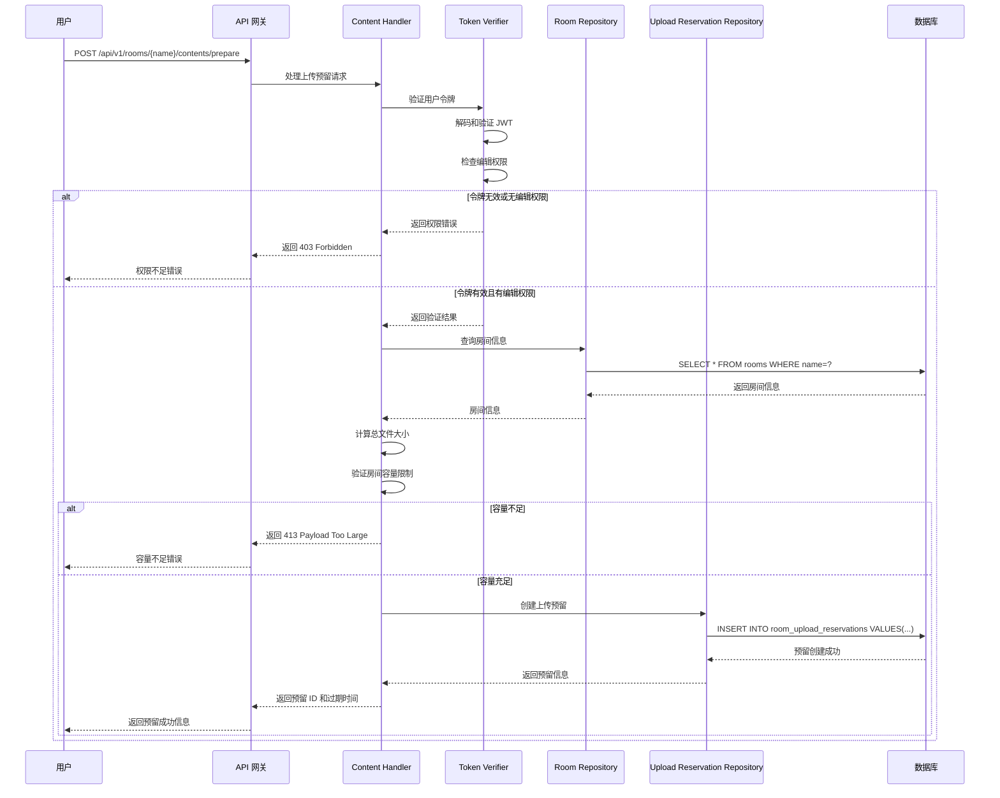
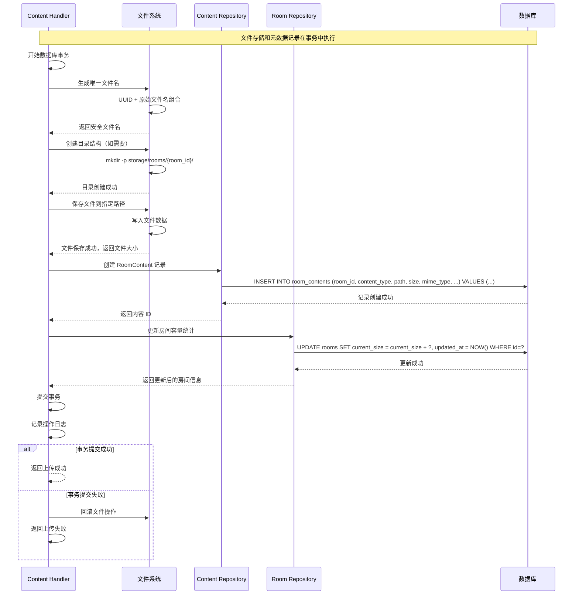
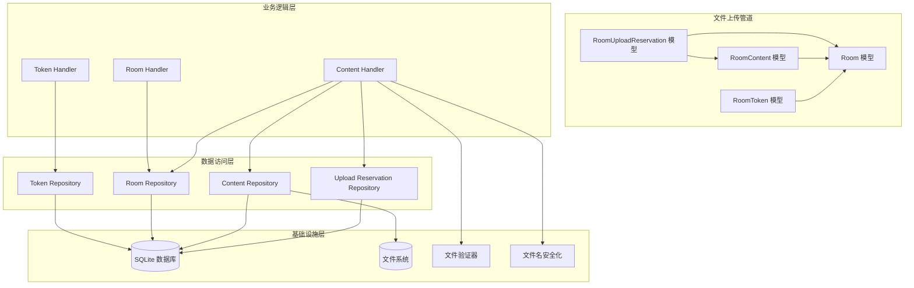

# System-2: 端到端文件上传管道系统

## 1. 系统概述

端到端文件上传管道系统是 Elizabeth
文件分享平台的核心数据传输子系统，负责管理从用户发起上传请求到文件安全存储的完整流程。系统采用预留-上传-确认的三阶段架构，通过
RoomUploadReservation、RoomContent
和认证系统的协同工作，确保大文件上传的可靠性和容量控制的准确性。该系统支持多种内容类型（文本、图片、文件、URL），提供文件类型验证、大小限制、路径安全等安全机制，为用户提供一个安全、高效、可控的文件上传体验。

系统的核心价值在于通过预留机制解决了并发上传时的容量冲突问题，通过分阶段处理确保了数据一致性，通过多层验证保障了系统安全性。每个上传操作都有完整的生命周期管理，从预留空间开始，到文件验证、存储保存、元数据记录，最终到预留清理，形成了一个闭环的管理体系。

## 2. 核心业务流程

### 2.1 上传预留流程



上传预留流程的关键步骤：

1. **权限验证**：验证用户是否具有编辑权限
2. **容量检查**：计算总文件大小，验证房间容量限制
3. **预留创建**：在
   [`room_upload_reservations`](crates/board/migrations/006_create_room_upload_reservations_table.sql)
   表中创建预留记录
4. **过期时间设置**：预留默认有效期为 10 分钟，防止长时间占用
5. **冲突避免**：通过预留机制避免并发上传的容量冲突

### 2.2 文件接收和验证流程

```mermaid
sequenceDiagram
    participant U as 用户
    participant API as API 网关
    participant CH as Content Handler
    participant TV as Token Verifier
    participant URR as Upload Reservation Repository
    participant CRR as Content Repository
    participant FS as 文件系统
    participant DB as 数据库

    U->>API: POST /api/v1/rooms/{name}/contents?reservation_id=123
    API->>CH: 处理文件上传请求
    CH->>TV: 验证用户令牌
    TV->>TV: 解码和验证 JWT
    TV->>TV: 检查编辑权限

    alt 令牌无效或无编辑权限
        TV-->>CH: 返回权限错误
        CH-->>API: 返回 403 Forbidden
        API-->>U: 权限不足错误
    else 令牌有效且有编辑权限
        TV-->>CH: 返回验证结果
        CH->>URR: 查询预留记录
        URR->>DB: SELECT * FROM room_upload_reservations WHERE id=?
        DB-->>URR: 返回预留信息
        URR-->>CH: 预留信息

        CH->>CH: 验证预留有效性
        alt 预留无效或已过期
            CH-->>API: 返回 410 Gone
            API-->>U: 预留已过期错误
        else 预留有效
            CH->>CH: 验证文件类型和大小
            alt 文件类型不支持
                CH-->>API: 返回 415 Unsupported Media Type
                API--->U: 文件类型不支持错误
            else 文件验证通过
                CH->>FS: 生成安全的文件路径
                CH->>FS: 保存文件到存储
                FS-->>CH: 返回文件路径和大小

                CH->>CRR: 创建内容记录
                CRR->>DB: INSERT INTO room_contents VALUES(...)
                DB-->>CRR: 内容记录创建成功
                CRR-->>CH: 返回内容信息

                CH->>RR: 更新房间当前大小
                RR->>DB: UPDATE rooms SET current_size = current_size + ? WHERE id=?
                DB-->>RR: 更新成功

                CH->>URR: 标记预留为已消费
                URR->>DB: UPDATE room_upload_reservations SET consumed_at = NOW() WHERE id=?
                DB-->>URR: 更新成功

                CH-->>API: 返回上传成功信息
                API--->U: 返回内容信息
            end
        end
    end
```

文件接收和验证流程的关键验证点：

1. **预留验证**：检查预留是否存在、是否过期、是否已消费
2. **文件类型验证**：检查文件扩展名和 MIME 类型
3. **文件大小验证**：确保文件大小不超过预留的大小
4. **路径安全化**：使用
   [`sanitize_filename`](crates/board/src/handlers/content.rs) 确保文件路径安全
5. **原子性操作**：文件保存和数据库记录在同一事务中完成

### 2.3 文件存储和元数据记录流程



文件存储和元数据记录流程的特点：

1. **事务安全**：文件操作和数据库操作在同一事务中
2. **路径唯一性**：使用 UUID 确保文件名唯一，避免冲突
3. **目录结构**：按房间 ID 组织目录结构，便于管理
4. **容量同步**：文件保存成功后立即更新房间容量统计
5. **错误回滚**：任何步骤失败都会清理已创建的资源

### 2.4 上传完成和预留清理流程

```mermaid
sequenceDiagram
    participant SCHEDULER as 定时任务
    participant URR as Upload Reservation Repository
    participant RR as Room Repository
    participant DB as 数据库

    Note over SCHEDULER,DB: 每5分钟执行一次清理任务
    SCHEDULER->>URR: 查询过期预留
    URR->>DB: SELECT * FROM room_upload_reservations WHERE expires_at <= NOW() AND consumed_at IS NULL
    DB-->>URR: 返回过期预留列表

    loop 处理每个过期预留
        SCHEDULER->>URR: 查询预留关联的房间
        URR->>DB: SELECT room_id FROM room_upload_reservations WHERE id=?
        DB-->>URR: 返回房间 ID

        SCHEDULER->>RR: 释放预留的容量
        RR->>DB: UPDATE rooms SET current_size = current_size - ? WHERE id=?
        DB-->>RR: 容量释放成功
        RR-->>SCHEDULER: 返回更新结果

        SCHEDULER->>URR: 删除预留记录
        URR->>DB: DELETE FROM room_upload_reservations WHERE id=?
        DB-->>URR: 预留删除成功
        URR-->>SCHEDULER: 删除完成
    end

    SCHEDULER->>URR: 查询长时间未消费的预留
    URR->>DB: SELECT * FROM room_upload_reservations WHERE created_at <= NOW() - INTERVAL '1 hour' AND consumed_at IS NULL
    DB-->>URR: 返回长时间未消费的预留

    loop 处理长时间未消费的预留
        SCHEDULER->>URR: 标记为异常并清理
        URR->>DB: UPDATE room_upload_reservations SET consumed_at = NOW() WHERE id=?
        DB-->>URR: 标记成功
        URR--->SCHEDULER: 标记完成
    end
```

预留清理流程的注意事项：

1. **自动清理**：过期的预留会自动清理，释放占用的容量
2. **异常处理**：长时间未消费的预留会被标记为异常
3. **容量恢复**：清理时会恢复被预留但未使用的容量
4. **日志记录**：所有清理操作都会被记录到审计日志中

## 3. 跨模型交互

### 3.1 RoomUploadReservation 与其他模型的交互

RoomUploadReservation 模型作为上传预留的核心，与其他模型存在密切的交互关系：

**与 Room 模型的交互**：

- 预留创建时检查房间的 `max_size` 和 `current_size`
- 预留成功后，房间的可用容量会临时减少（逻辑上的预留）
- 预留消费或清理时，房间的 `current_size` 会相应更新

**与 RoomContent 模型的交互**：

- 预留中定义的文件清单必须与实际上传的文件匹配
- 内容创建成功后，预留会被标记为已消费
- 预留中的文件大小用于验证实际上传文件的大小

**与认证系统的交互**：

- 预留创建和消费都需要有效的 JWT 令牌
- 令牌中的 `room_id` 必须与预留关联的房间 ID 匹配
- 令牌中的编辑权限是创建预留的前提条件

### 3.2 数据流和依赖关系



**关键依赖关系**：

1. **RoomUploadReservation → Room**：预留创建依赖房间容量状态
2. **RoomUploadReservation → RoomContent**：预留约束内容创建
3. **RoomContent → Room**：内容创建更新房间容量统计
4. **RoomToken → Room**：令牌验证需要房间状态检查

### 3.3 事务处理和数据一致性

系统采用复杂的事务机制确保跨模型操作的原子性：

**文件上传事务**：

```sql
BEGIN TRANSACTION;

-- 1. 检查预留状态
SELECT reserved_size, consumed_at FROM room_upload_reservations
WHERE id = ? AND room_id = ? AND consumed_at IS NULL AND expires_at > NOW()
FOR UPDATE;

-- 2. 创建内容记录
INSERT INTO room_contents (room_id, content_type, path, size, mime_type, ...)
VALUES (?, ?, ?, ?, ?, ...);

-- 3. 更新房间容量
UPDATE rooms SET current_size = current_size + ?, updated_at = NOW()
WHERE id = ?;

-- 4. 标记预留为已消费
UPDATE room_upload_reservations SET consumed_at = NOW()
WHERE id = ?;

COMMIT;
```

**预留创建事务**：

```sql
BEGIN TRANSACTION;

-- 1. 检查房间容量
SELECT max_size, current_size FROM rooms WHERE id = ? FOR UPDATE;

-- 2. 创建预留记录
INSERT INTO room_upload_reservations (room_id, token_jti, file_manifest, reserved_size, expires_at, ...)
VALUES (?, ?, ?, ?, ?, ...);

-- 3. 逻辑预留容量（可选）
-- UPDATE rooms SET reserved_size = reserved_size + ? WHERE id = ?;

COMMIT;
```

## 4. 关键算法和逻辑

### 4.1 容量控制算法

```rust
impl Room {
    pub fn can_add_content(&self, content_size: i64) -> bool {
        self.permission.can_edit() && self.current_size + content_size <= self.max_size
    }

    pub fn can_reserve(&self, reserve_size: i64) -> bool {
        self.permission.can_edit() &&
        self.current_size + reserve_size <= self.max_size &&
        reserve_size > 0
    }
}

impl RoomUploadReservation {
    pub fn is_valid(&self) -> bool {
        self.consumed_at.is_none() &&
        self.expires_at > Utc::now().naive_utc()
    }

    pub fn can_consume(&self, actual_size: i64) -> bool {
        self.is_valid() && actual_size <= self.reserved_size
    }
}
```

### 4.2 文件名安全化算法

```rust
use sanitize_filename::sanitize;
use uuid::Uuid;

pub fn generate_safe_filename(original_name: &str, room_id: i64) -> String {
    // 1. 生成 UUID 作为前缀
    let uuid = Uuid::new_v4().to_string();

    // 2. 安全化原始文件名
    let safe_name = sanitize(original_name);

    // 3. 移除可能的路径分隔符
    let safe_name = safe_name.replace(['/', '\\', ':', '*', '?', '"', '<', '>', '|'], "_");

    // 4. 组合最终文件名
    format!("{}_{}", uuid, safe_name)
}

pub fn build_file_path(room_id: i64, filename: &str) -> String {
    format!("storage/rooms/{}/{}", room_id, filename)
}
```

### 4.3 文件类型验证算法

```rust
use mime_guess::from_path;
use std::path::Path;

pub fn validate_file_type(file_path: &str, allowed_types: &[&str]) -> Result<String, anyhow::Error> {
    // 1. 从文件扩展名推断 MIME 类型
    let mime_type = from_path(Path::new(file_path))
        .first_or_octet_stream()
        .to_string();

    // 2. 检查是否在允许的类型列表中
    if !allowed_types.iter().any(|&allowed| {
        mime_type.starts_with(allowed) || mime_type == allowed
    }) {
        return Err(anyhow!("File type {} is not allowed", mime_type));
    }

    // 3. 特殊检查：禁止可执行文件
    if is_executable_type(&mime_type) {
        return Err(anyhow!("Executable files are not allowed"));
    }

    Ok(mime_type)
}

fn is_executable_type(mime_type: &str) -> bool {
    mime_type.starts_with("application/x-executable") ||
    mime_type.starts_with("application/x-msdownload") ||
    mime_type == "application/x-msdos-program" ||
    mime_type == "application/x-sh"
}
```

### 4.4 上传预留管理算法

```rust
impl RoomUploadReservationRepository {
    pub async fn reserve_upload(
        &self,
        room: &Room,
        token_jti: &str,
        file_manifest: &str,
        total_size: i64,
        ttl: chrono::Duration,
    ) -> Result<(RoomUploadReservation, Room), anyhow::Error> {
        let mut tx = self.pool.begin().await?;

        // 1. 检查房间容量（行级锁）
        let locked_room = sqlx::query_as!(
            Room,
            "SELECT * FROM rooms WHERE id = ? FOR UPDATE",
            room.id.unwrap()
        )
        .fetch_one(&mut tx)
        .await?;

        // 2. 验证容量限制
        if !locked_room.can_reserve(total_size) {
            return Err(anyhow!("Room size limit exceeded"));
        }

        // 3. 创建预留记录
        let reservation = RoomUploadReservation {
            id: None,
            room_id: room.id.unwrap(),
            token_jti: token_jti.to_string(),
            file_manifest: file_manifest.to_string(),
            reserved_size: total_size,
            reserved_at: Utc::now().naive_utc(),
            expires_at: (Utc::now() + ttl).naive_utc(),
            consumed_at: None,
            created_at: Utc::now().naive_utc(),
            updated_at: Utc::now().naive_utc(),
        };

        let reservation = sqlx::query_as!(
            RoomUploadReservation,
            r#"
            INSERT INTO room_upload_reservations
            (room_id, token_jti, file_manifest, reserved_size, reserved_at, expires_at, created_at, updated_at)
            VALUES (?, ?, ?, ?, ?, ?, ?, ?)
            RETURNING *
            "#,
            reservation.room_id,
            reservation.token_jti,
            reservation.file_manifest,
            reservation.reserved_size,
            reservation.reserved_at,
            reservation.expires_at,
            reservation.created_at,
            reservation.updated_at
        )
        .fetch_one(&mut tx)
        .await?;

        // 4. 提交事务
        tx.commit().await?;

        Ok((reservation, locked_room))
    }
}
```

## 5. 错误处理和恢复

### 5.1 常见错误场景

**预留创建失败**：

- **容量不足**：返回 HTTP 413 Payload Too Large
- **权限不足**：返回 HTTP 403 Forbidden
- **预留冲突**：返回 HTTP 409 Conflict
- **数据库错误**：返回 HTTP 500 Internal Server Error

**文件上传失败**：

- **预留无效**：返回 HTTP 410 Gone
- **文件类型不支持**：返回 HTTP 415 Unsupported Media Type
- **文件过大**：返回 HTTP 413 Payload Too Large
- **存储空间不足**：返回 HTTP 507 Insufficient Storage

**文件验证失败**：

- **文件名不安全**：返回 HTTP 400 Bad Request
- **MIME 类型不匹配**：返回 HTTP 400 Bad Request
- **文件损坏**：返回 HTTP 400 Bad Request

### 5.2 错误恢复机制

**事务回滚恢复**：

```rust
pub async fn upload_file_with_rollback(
    &self,
    reservation_id: i64,
    file_data: &[u8],
    filename: &str,
) -> Result<RoomContent, anyhow::Error> {
    let mut tx = self.pool.begin().await?;
    let file_path = None;

    match self.upload_file_tx(&mut tx, reservation_id, file_data, filename).await {
        Ok(content) => {
            tx.commit().await?;
            Ok(content)
        }
        Err(e) => {
            // 回滚数据库事务
            tx.rollback().await?;

            // 清理已创建的文件
            if let Some(path) = file_path {
                let _ = std::fs::remove_file(&path);
            }

            Err(e)
        }
    }
}
```

**预留超时恢复**：

```rust
pub async fn cleanup_expired_reservations(&self) -> Result<u64, anyhow::Error> {
    let mut tx = self.pool.begin().await?;

    // 1. 查找过期预留
    let expired = sqlx::query!(
        "SELECT id, room_id, reserved_size FROM room_upload_reservations
         WHERE expires_at <= NOW() AND consumed_at IS NULL"
    )
    .fetch_all(&mut tx)
    .await?;

    let mut cleaned_count = 0;

    for reservation in expired {
        // 2. 释放预留的容量
        sqlx::query!(
            "UPDATE rooms SET current_size = current_size - ? WHERE id = ?",
            reservation.reserved_size,
            reservation.room_id
        )
        .execute(&mut tx)
        .await?;

        // 3. 删除预留记录
        sqlx::query!(
            "DELETE FROM room_upload_reservations WHERE id = ?",
            reservation.id
        )
        .execute(&mut tx)
        .await?;

        cleaned_count += 1;
    }

    tx.commit().await?;
    Ok(cleaned_count)
}
```

**文件系统错误恢复**：

- 磁盘空间不足时，自动清理临时文件
- 文件写入失败时，确保部分文件被清理
- 权限错误时，记录详细日志并返回友好错误信息

## 6. 安全性

### 6.1 文件安全机制

**文件名安全化**：

- 使用 [`sanitize_filename`](crates/board/src/handlers/content.rs) 清理危险字符
- UUID 前缀确保文件名唯一性，避免覆盖攻击
- 路径分隔符替换，防止目录遍历攻击

**文件类型验证**：

- 基于文件扩展名和 MIME 类型的双重验证
- 禁止可执行文件和脚本文件上传
- 支持白名单机制，只允许特定类型文件

**文件内容扫描**：

- 文件头验证，确保文件类型与扩展名匹配
- 大文件分块验证，防止恶意文件注入
- 可选的病毒扫描集成（未来改进项）

### 6.2 访问控制

**权限验证**：

- 多层权限检查：房间级别 + 令牌级别 + 操作级别
- 编辑权限是文件上传的前提条件
- 预留创建和消费需要相同的令牌

**容量限制**：

- 房间级别的总容量限制
- 单文件大小限制
- 并发上传的容量预留机制

**时间控制**：

- 预留有效期限制（默认 10 分钟）
- 上传超时控制
- 自动清理过期预留

### 6.3 数据保护

**传输安全**：

- 强制 HTTPS，防止中间人攻击
- 文件传输过程中的完整性验证
- 支持断点续传（未来改进项）

**存储安全**：

- 文件存储路径不可预测（UUID 前缀）
- 支持文件加密存储（可选功能）
- 定期备份和恢复机制

## 7. 性能优化

### 7.1 并发处理优化

**预留机制优化**：

```rust
// 使用行级锁避免并发冲突
pub async fn reserve_with_lock(
    &self,
    room_id: i64,
    reserve_size: i64,
) -> Result<RoomUploadReservation, anyhow::Error> {
    let mut tx = self.pool.begin().await?;

    // 行级锁确保并发安全
    let room = sqlx::query_as!(
        Room,
        "SELECT * FROM rooms WHERE id = ? FOR UPDATE",
        room_id
    )
    .fetch_one(&mut tx)
    .await?;

    if !room.can_reserve(reserve_size) {
        tx.rollback().await?;
        return Err(anyhow!("Capacity limit exceeded"));
    }

    // 创建预留...

    tx.commit().await?;
    Ok(reservation)
}
```

**文件流式处理**：

```rust
use tokio::fs::File;
use tokio::io::AsyncReadExt;

pub async fn stream_upload_file(
    &self,
    mut file_data: impl AsyncReadExt + Unpin,
    file_path: &str,
    max_size: u64,
) -> Result<u64, anyhow::Error> {
    let mut file = File::create(file_path).await?;
    let mut buffer = [0; 8192];
    let mut total_size = 0u64;

    loop {
        let bytes_read = file_data.read(&mut buffer).await?;
        if bytes_read == 0 {
            break;
        }

        total_size += bytes_read as u64;
        if total_size > max_size {
            // 清理部分文件
            let _ = tokio::fs::remove_file(file_path).await;
            return Err(anyhow!("File size exceeds limit"));
        }

        file.write_all(&buffer[..bytes_read]).await?;
    }

    Ok(total_size)
}
```

### 7.2 数据库优化

**索引优化**：

```sql
-- 预留表关键索引
CREATE INDEX idx_room_upload_reservations_room_id ON room_upload_reservations(room_id);
CREATE INDEX idx_room_upload_reservations_expires_at ON room_upload_reservations(expires_at);
CREATE INDEX idx_room_upload_reservations_token_jti ON room_upload_reservations(token_jti);
CREATE INDEX idx_room_upload_reservations_consumed_at ON room_upload_reservations(consumed_at);

-- 内容表关键索引
CREATE INDEX idx_room_contents_room_id ON room_contents(room_id);
CREATE INDEX idx_room_contents_content_type ON room_contents(content_type);
CREATE INDEX idx_room_contents_created_at ON room_contents(created_at);
```

**查询优化**：

```rust
// 批量查询预留状态
pub async fn batch_check_reservations(
    &self,
    reservation_ids: &[i64],
) -> Result<Vec<RoomUploadReservation>, anyhow::Error> {
    let placeholders = reservation_ids.iter().map(|_| "?").join(",");
    let query = format!(
        "SELECT * FROM room_upload_reservations WHERE id IN ({})",
        placeholders
    );

    let mut query_builder = sqlx::query_as::<_, RoomUploadReservation>(&query);
    for &id in reservation_ids {
        query_builder = query_builder.bind(id);
    }

    query_builder.fetch_all(&self.pool).await
}
```

### 7.3 缓存策略

**房间信息缓存**：

```rust
use std::collections::HashMap;
use tokio::time::{Duration, Instant};

pub struct RoomCache {
    cache: Arc<RwLock<HashMap<i64, (Room, Instant)>>>,
    ttl: Duration,
}

impl RoomCache {
    pub async fn get(&self, room_id: i64) -> Option<Room> {
        let cache = self.cache.read().await;
        if let Some((room, timestamp)) = cache.get(&room_id) {
            if timestamp.elapsed() < self.ttl {
                return Some(room.clone());
            }
        }
        None
    }

    pub async fn set(&self, room: Room) {
        let mut cache = self.cache.write().await;
        cache.insert(room.id.unwrap(), (room, Instant::now()));
    }
}
```

**预留状态缓存**：

- 活跃预留状态缓存到内存中
- 定期同步数据库状态
- 支持分布式缓存（Redis）

## 8. 监控和告警

### 8.1 关键监控指标

**业务指标**：

- 上传成功率：目标 > 98%
- 平均上传时间：P95 < 30s
- 预留利用率：监控预留空间的实际使用情况
- 文件类型分布：了解用户上传的文件类型偏好

**技术指标**：

- 并发上传数：监控系统并发处理能力
- 存储使用率：磁盘空间使用情况
- 数据库连接池使用率：< 80%
- 文件系统 I/O：监控磁盘性能

**安全指标**：

- 恶意文件上传尝试次数
- 文件类型验证失败率
- 权限验证失败次数
- 异常大文件上传尝试

### 8.2 告警配置

**业务告警**：

- 上传失败率 > 5%
- 预留超时率 > 10%
- 存储使用率 > 85%
- 平均上传时间 > 60s

**技术告警**：

- 磁盘空间不足 < 10%
- 数据库连接数 > 80%
- 文件系统错误率 > 1%
- 并发上传数 > 1000

**安全告警**：

- 恶意文件上传尝试 > 10 次/分钟
- 权限提升尝试 > 5 次/分钟
- 异常大文件上传 > 100MB
- 可疑文件类型上传

### 8.3 日志管理

```rust
// 结构化日志示例
info!(
    room_id = %room_id,
    reservation_id = %reservation_id,
    file_name = %filename,
    file_size = %file_size,
    upload_time = %upload_duration,
    "File uploaded successfully"
);

error!(
    error = %e,
    room_id = %room_id,
    reservation_id = %reservation_id,
    file_name = %filename,
    action = "file_upload_failed",
    "Failed to upload file"
);

warn!(
    room_id = %room_id,
    reserved_size = %reserved_size,
    current_size = %current_size,
    max_size = %max_size,
    action = "capacity_limit_warning",
    "Room approaching capacity limit"
);
```

## 9. 测试策略

### 9.1 单元测试

**预留管理测试**：

```rust
#[cfg(test)]
mod tests {
    use super::*;

    #[tokio::test]
    async fn test_reserve_upload() {
        let room = Room::new("test".to_string(), None);
        let repo = RoomUploadReservationRepository::new(pool);

        let (reservation, _) = repo.reserve_upload(
            &room,
            "test-jti",
            "file1.jpg:1024",
            1024,
            chrono::Duration::minutes(10),
        ).await.unwrap();

        assert!(reservation.id.is_some());
        assert!(reservation.is_valid());
        assert_eq!(reservation.reserved_size, 1024);
    }

    #[tokio::test]
    async fn test_reserve_capacity_limit() {
        let mut room = Room::new("test".to_string(), None);
        room.max_size = 1000;
        room.current_size = 800;

        let repo = RoomUploadReservationRepository::new(pool);

        let result = repo.reserve_upload(
            &room,
            "test-jti",
            "file1.jpg:300",
            300, // 超过剩余容量
            chrono::Duration::minutes(10),
        ).await;

        assert!(result.is_err());
    }
}
```

**文件验证测试**：

```rust
#[test]
fn test_filename_sanitization() {
    assert_eq!(
        generate_safe_filename("../../../etc/passwd", 1),
        contains("passwd") && !contains("../")
    );

    assert_eq!(
        generate_safe_filename("normal file.txt", 1),
        contains("normal_file.txt")
    );

    assert_ne!(
        generate_safe_filename("file.txt", 1),
        generate_safe_filename("file.txt", 1)
    ); // UUID 前缀确保唯一性
}

#[test]
fn test_file_type_validation() {
    let allowed_types = vec!["image/", "text/", "application/pdf"];

    assert!(validate_file_type("test.jpg", &allowed_types).is_ok());
    assert!(validate_file_type("test.pdf", &allowed_types).is_ok());
    assert!(validate_file_type("test.exe", &allowed_types).is_err());
    assert!(validate_file_type("test.scr", &allowed_types).is_err());
}
```

### 9.2 集成测试

**端到端上传流程测试**：

```rust
#[tokio::test]
async fn test_complete_upload_flow() {
    // 1. 创建房间
    let room_response = client
        .post(&format!("{}/api/v1/rooms/test-room", &server_addr))
        .json(&CreateRoomParams { password: None })
        .send()
        .await?;

    // 2. 获取访问令牌
    let token_response = client
        .post(&format!("{}/api/v1/rooms/test-room/tokens", &server_addr))
        .json(&IssueTokenRequest { password: None, token: None })
        .send()
        .await?;

    let token_response: IssueTokenResponse = token_response.json().await?;

    // 3. 创建上传预留
    let prepare_response = client
        .post(&format!("{}/api/v1/rooms/test-room/contents/prepare", &server_addr))
        .query(&[("token", &token_response.token)])
        .json(&UploadPreparationRequest {
            files: vec![UploadFileDescriptor {
                name: "test.txt".to_string(),
                size: 1024,
                mime: Some("text/plain".to_string()),
            }],
        })
        .send()
        .await?;

    assert_eq!(prepare_response.status(), 200);
    let prepare_response: UploadPreparationResponse = prepare_response.json().await?;

    // 4. 上传文件
    let file_content = "Hello, World!".repeat(64); // 1024 bytes
    let upload_response = client
        .post(&format!("{}/api/v1/rooms/test-room/contents", &server_addr))
        .query(&[
            ("token", &token_response.token),
            ("reservation_id", &prepare_response.reservation_id.to_string()),
        ])
        .header("Content-Type", "text/plain")
        .body(file_content)
        .send()
        .await?;

    assert_eq!(upload_response.status(), 200);
    let upload_response: UploadContentResponse = upload_response.json().await?;
    assert_eq!(upload_response.uploaded.len(), 1);
}
```

### 9.3 性能测试

**并发上传测试**：

```rust
#[tokio::test]
async fn test_concurrent_uploads() {
    let room_name = "concurrent-upload-test";
    let client = reqwest::Client::new();

    // 创建房间和获取令牌...

    let mut handles = vec![];
    for i in 0..50 {
        let client = client.clone();
        let server_addr = server_addr.clone();
        let token = token.clone();
        let room_name = room_name.to_string();

        let handle = tokio::spawn(async move {
            // 1. 创建预留
            let prepare_response = client
                .post(&format!("{}/api/v1/rooms/{}/contents/prepare", server_addr, room_name))
                .query(&[("token", &token)])
                .json(&UploadPreparationRequest {
                    files: vec![UploadFileDescriptor {
                        name: format!("file_{}.txt", i),
                        size: 1024,
                        mime: Some("text/plain".to_string()),
                    }],
                })
                .send()
                .await?;

            let prepare_response: UploadPreparationResponse = prepare_response.json().await?;

            // 2. 上传文件
            let file_content = format!("Content for file {}", i).repeat(64);
            let upload_response = client
                .post(&format!("{}/api/v1/rooms/{}/contents", server_addr, room_name))
                .query(&[
                    ("token", &token),
                    ("reservation_id", &prepare_response.reservation_id.to_string()),
                ])
                .header("Content-Type", "text/plain")
                .body(file_content)
                .send()
                .await?;

            upload_response.status()
        });

        handles.push(handle);
    }

    // 等待所有上传完成
    let results = futures::future::join_all(handles).await;
    let success_count = results.iter().filter(|r| r.as_ref().unwrap() == &200).count();

    assert!(success_count > 45); // 至少 90% 成功率
}
```

## 10. 已知问题和改进建议

### 10.1 按优先级分类的改进项

**P0 优先级（紧急）**：

1. **容量计算精度**：文本内容使用 `text.len()` 计算大小，未考虑实际编码开销
   - 影响：容量控制不准确，可能导致超出限制
   - 解决方案：使用实际字节大小计算，考虑 UTF-8 编码开销
   - 预估工作量：1-2 天

2. **文件存储安全**：缺少文件内容的安全扫描和病毒检测
   - 影响：安全风险，可能上传恶意文件
   - 解决方案：集成病毒扫描引擎，实现文件内容安全检查
   - 预估工作量：3-5 天

**P1 优先级（重要）**：

1. **大文件分片上传**：当前不支持大文件的分片上传和断点续传
   - 影响：大文件上传体验差，网络中断需要重新上传
   - 解决方案：实现分片上传机制，支持断点续传
   - 预估工作量：5-7 天

2. **文件版本管理**：不支持文件的版本控制和历史记录
   - 影响：无法跟踪文件变更历史，恢复误删文件
   - 解决方案：设计文件版本系统，支持版本历史和恢复
   - 预估工作量：3-4 天

3. **存储路径优化**：缺少基于日期或类型的存储路径分层
   - 影响：单目录文件过多，影响性能
   - 解决方案：实现分层存储结构，按日期/类型组织文件
   - 预估工作量：2-3 天

**P2 优先级（优化）**：

1. **内容压缩**：不支持文本内容的自动压缩存储
   - 影响：存储空间浪费，传输效率低
   - 解决方案：实现内容压缩机制，支持 gzip 压缩
   - 预估工作量：2-3 天

2. **文件转换服务**：不支持图片格式转换或文档预览生成
   - 影响：用户体验，功能完整性
   - 解决方案：集成文件转换服务，支持格式转换和预览
   - 预估工作量：5-7 天

3. **CDN 集成**：不支持 CDN 集成和分布式存储
   - 影响：文件访问速度，全球用户体验
   - 解决方案：集成 CDN 服务，支持分布式存储
   - 预估工作量：3-4 天

4. **上传进度跟踪**：缺少实时上传进度反馈
   - 影响：用户体验，特别是大文件上传
   - 解决方案：实现 WebSocket 进度推送机制
   - 预估工作量：2-3 天

### 10.2 系统边界和限制

**当前系统限制**：

- 单文件大小限制：默认 100MB
- 并发上传数：受数据库连接池限制
- 存储类型：仅支持本地文件系统
- 上传方式：仅支持 HTTP multipart/form-data

**假设条件**：

- 网络环境稳定，延迟较低
- 用户上传的文件类型相对简单
- 存储空间充足，访问速度快
- 文件访问频率在合理范围内

**扩展建议**：

- 考虑集成对象存储服务（S3、MinIO）
- 支持多种上传协议（FTP、SFTP）
- 实现分布式文件存储
- 添加文件元数据搜索引擎

### 10.3 性能瓶颈分析

**当前瓶颈**：

1. **数据库写入**：每次上传都需要多次数据库操作
2. **文件 I/O**：大文件上传时的磁盘 I/O 瓶颈
3. **内存使用**：文件内容在内存中的缓存
4. **网络带宽**：上传速度受网络限制

**优化方向**：

1. **异步处理**：文件操作异步化，提高并发能力
2. **流式处理**：减少内存占用，支持更大文件
3. **批量操作**：减少数据库交互次数
4. **缓存优化**：缓存频繁访问的数据

---

**文档最后更新时间**：2025-10-21 **文档作者**：Elizabeth 开发团队
**文档版本**：v1.0.0 **关联代码路径**：

- 内容模型：[`crates/board/src/models/room/content.rs`](crates/board/src/models/room/content.rs)
- 上传预留：[`crates/board/src/models/room/upload_reservation.rs`](crates/board/src/models/room/upload_reservation.rs)
- 内容处理器：[`crates/board/src/handlers/content.rs`](crates/board/src/handlers/content.rs)
- 内容仓储：[`crates/board/src/repository/room_content_repostitory.rs`](crates/board/src/repository/room_content_repostitory.rs)
- 预留仓储：[`crates/board/src/repository/room_upload_reservation_repository.rs`](crates/board/src/repository/room_upload_reservation_repository.rs)
