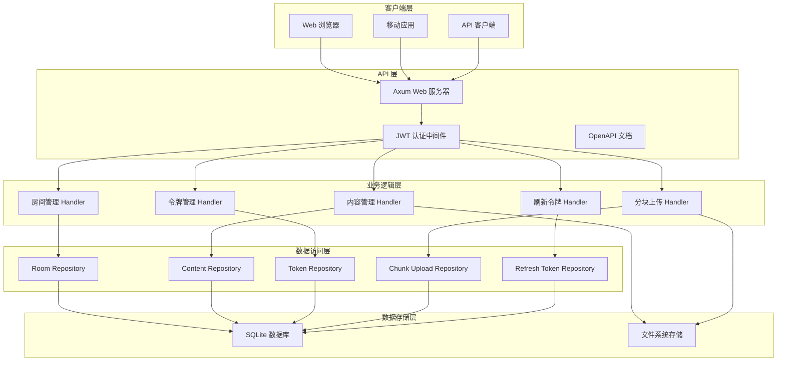
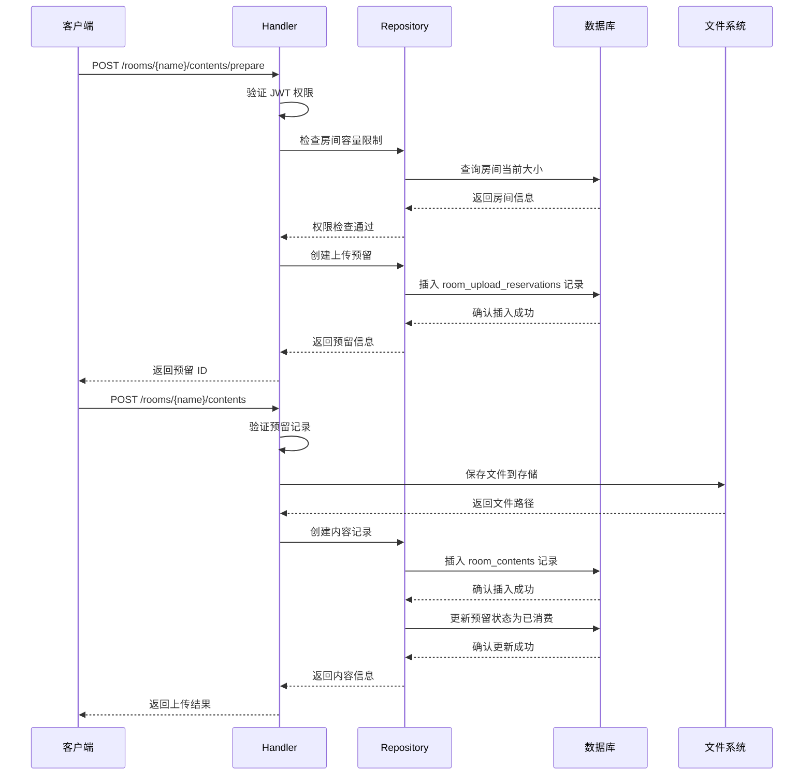
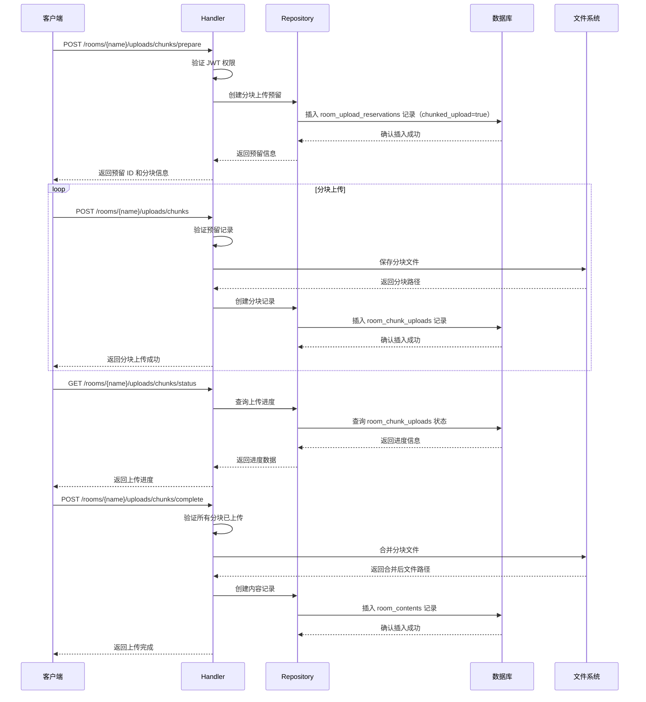
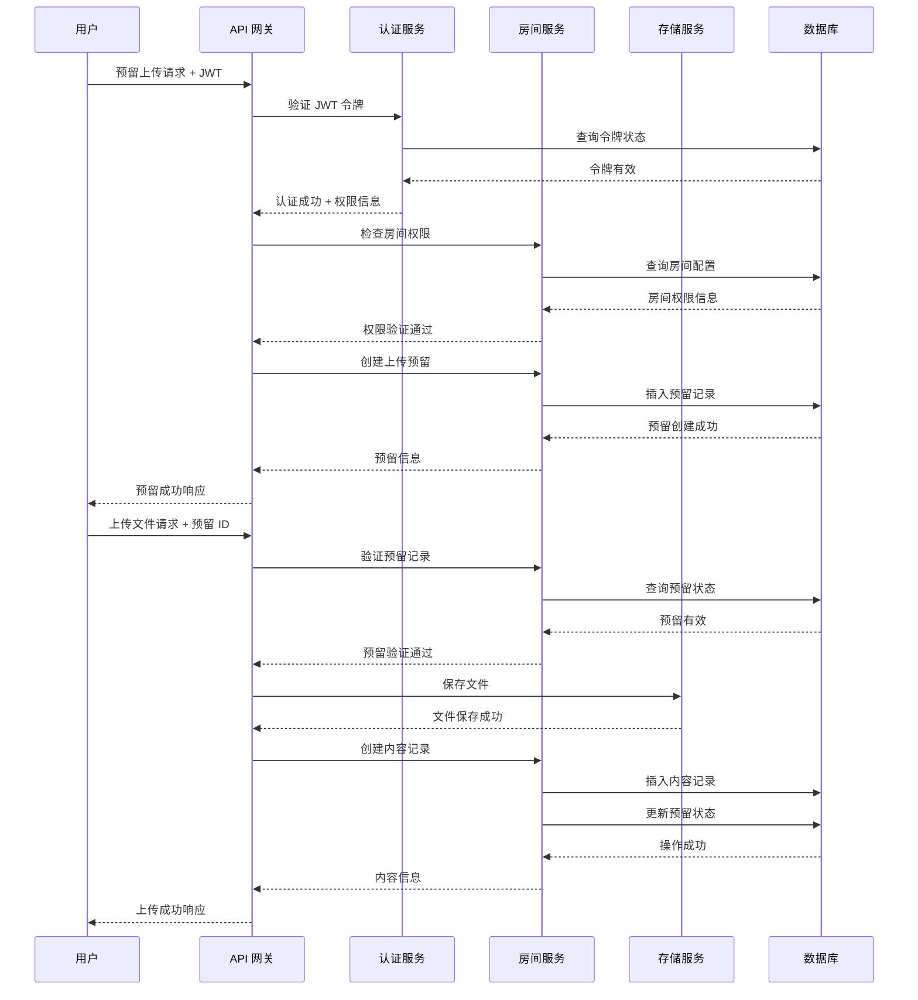
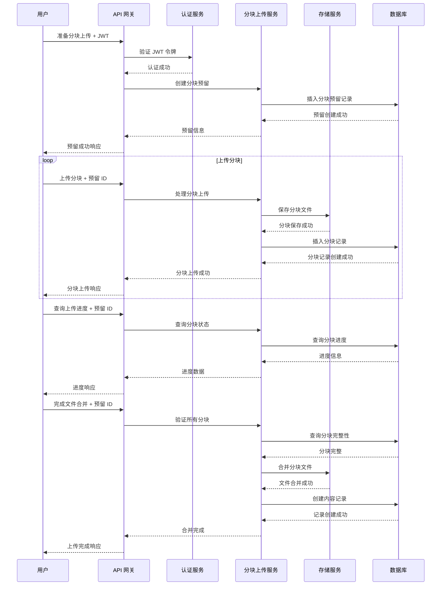

# Elizabeth 项目架构概览

## 1. 系统概览

### 一句话描述

Elizabeth 是一个基于 Rust
的现代化文件分享系统，采用房间为中心的设计理念，提供安全、临时的文件共享服务。

### 高层架构图



### 核心设计理念

Elizabeth 系统的核心设计理念是 **"Room" 而不是
"User"**，所有操作都围绕临时的、可配置的房间展开：

1. **无用户系统 (User-less)**：系统不设用户注册或登录，降低使用门槛
2. **房间即身份 (Room as Identity)**：通过进入房间实现身份验证，简化权限管理
3. **临时性与可控性**：房间支持过期时间、进入次数限制、文件大小限制
4. **权限嵌入机制**：JWT Token 中嵌入权限信息，减少实时数据库查询
5. **分块上传支持**：支持大文件分块上传和断点续传

## 2. 组件清单

### 服务组件

| 组件       | 技术栈             | 职责                         | 核心文件位置                    |
| ---------- | ------------------ | ---------------------------- | ------------------------------- |
| Web 服务器 | Axum 0.8.6         | HTTP 请求处理、路由管理      | `crates/board/src/lib.rs`       |
| 业务逻辑层 | Rust + Tokio       | 房间管理、内容处理、令牌管理 | `crates/board/src/handlers/`    |
| API 文档   | Utoipa + Scalar UI | OpenAPI 规范生成、交互式文档 | `crates/board/src/route/mod.rs` |
| 配置管理   | configrs           | 环境变量、应用配置           | `crates/configrs/`              |
| 日志系统   | logrs              | 结构化日志记录               | `crates/logrs/`                 |

### 数据存储组件

| 组件       | 技术栈            | 职责                         | 核心文件位置                 |
| ---------- | ----------------- | ---------------------------- | ---------------------------- |
| 主数据库   | SQLite + SQLx 0.8 | 房间、内容、令牌等元数据存储 | `crates/board/src/db/mod.rs` |
| 文件存储   | 本地文件系统      | 上传文件的物理存储           | `crates/board/storage/`      |
| 数据库迁移 | SQLx Migrate      | 数据库结构版本管理           | `crates/board/migrations/`   |

**当前迁移结构**：

- `001_initial_schema.sql` -
  初始数据库架构（包含基础表：rooms、room_contents、room_tokens、room_upload_reservations、room_access_logs）
- `002_refresh_tokens.sql` - 刷新令牌机制（新增表：room_refresh_tokens）
- `003_chunked_upload.sql` - 分块上传功能（扩展 room_upload_reservations
  表，新增 room_chunk_uploads 表）

### 认证授权组件

| 组件         | 技术栈            | 职责                     | 核心文件位置                                                   |
| ------------ | ----------------- | ------------------------ | -------------------------------------------------------------- |
| JWT 认证     | jsonwebtoken 10.0 | 令牌生成、验证、撤销     | `crates/board/src/services/token.rs`                           |
| 权限系统     | bitflags          | 细粒度权限控制           | `crates/board/src/models/room/permission.rs`                   |
| 令牌管理     | RoomToken         | 访问令牌生命周期管理     | `crates/board/src/models/room/token.rs`                        |
| 刷新令牌服务 | RefreshToken      | 刷新令牌生成、验证、管理 | `crates/board/src/services/refresh_token_service.rs`           |
| 令牌黑名单   | TokenBlacklist    | 撤销令牌管理             | `crates/board/src/repository/room_refresh_token_repository.rs` |

### 外部依赖

| 依赖              | 版本  | 用途                            |
| ----------------- | ----- | ------------------------------- |
| axum              | 0.8.6 | 异步 Web 框架                   |
| sqlx              | 0.8   | 异步 SQL 工具包，编译时查询检查 |
| jsonwebtoken      | 10.0  | JWT 令牌处理                    |
| utoipa            | 5     | OpenAPI 文档生成                |
| tokio             | 1.0   | 异步运行时                      |
| chrono            | 0.4   | 时间处理                        |
| serde             | 1     | 序列化/反序列化                 |
| bitflags          | 2     | 位标志权限系统                  |
| sanitize-filename | 0.5   | 文件名安全过滤                  |

## 3. 数据流

### 普通上传流程



### 分块上传流程



### 下载流程


### 房间生命周期


## 4. 部署与运维要点

### 环境变量列表

| 变量名                   | 类型   | 默认值                | 说明                     |
| ------------------------ | ------ | --------------------- | ------------------------ |
| `ELIZABETH_ADDR`         | string | `127.0.0.1`           | 服务监听地址             |
| `ELIZABETH_PORT`         | number | `8080`                | 服务监听端口             |
| `ELIZABETH_DB_URL`       | string | `sqlite:elizabeth.db` | 数据库连接字符串         |
| `ELIZABETH_JWT_SECRET`   | string | -                     | JWT 签名密钥（必须设置） |
| `ELIZABETH_LOG_LEVEL`    | string | `info`                | 日志级别                 |
| `ELIZABETH_STORAGE_PATH` | string | `./storage`           | 文件存储路径             |

### 密钥管理策略

1. **JWT 密钥生成**：
   ```bash
   # 生成强随机密钥
   openssl rand -base64 32
   ```

2. **生产环境密钥管理**：
   - 使用环境变量或密钥管理服务
   - 定期轮换 JWT 密钥（建议每 90 天）
   - 密钥长度至少 32 字符

3. **密钥存储**：
   - 开发环境：可使用 `.env` 文件
   - 生产环境：使用 Kubernetes Secrets 或 AWS Secrets Manager

### 备份和恢复策略

1. **数据库备份**：
   ```bash
   # SQLite 数据库备份
   sqlite3 elizabeth.db ".backup backup_$(date +%Y%m%d).db"
   ```

2. **文件存储备份**：
   ```bash
   # 文件系统备份
   tar -czf storage_backup_$(date +%Y%m%d).tar.gz ./storage/
   ```

3. **自动化备份**：
   - 使用 cron 定时任务每日备份
   - 保留最近 30 天的备份文件
   - 备份文件存储到异地存储

## 5. 安全边界

### 加密-at-rest 策略

1. **数据库加密**：
   - SQLite 使用 WAL 模式
   - 定期备份数据库文件
   - 生产环境考虑使用 SQLCipher

2. **文件存储加密**：
   - 当前版本：明文存储
   - 计划改进：支持文件内容加密存储（可选功能）
   - 使用 AES-256-GCM 算法
   - 密钥与房间关联，房间删除时密钥销毁

### TLS 传输安全

1. **HTTPS 配置**：
   - 生产环境强制使用 HTTPS
   - 使用 Let's Encrypt 或商业证书
   - 配置 HSTS 头增强安全性

2. **TLS 版本**：
   - 最低支持 TLS 1.2
   - 禁用弱加密套件
   - 定期更新 TLS 配置

### JWT 签名验证

1. **签名算法**：
   - 使用 HS256 算法（当前实现）
   - 密钥长度至少 32 字符
   - 支持密钥轮换机制

2. **令牌验证**：
   - 验证签名有效性
   - 检查令牌过期时间
   - 验证令牌撤销状态

### 密码哈希策略

1. **房间密码**：
   - 当前版本：明文存储（待改进）
   - 计划改进：使用 Argon2id 哈希
   - 哈希参数：内存 64MB，迭代次数 3

2. **密码复杂度**：
   - 最小长度：8 字符
   - 支持特殊字符
   - 定期密码轮换提醒

## 6. 典型时序图

### 文件上传时序



### 分块上传时序



### 文件下载时序


### 房间生命周期时序


## 7. 开发者快速上手指南

### 本地运行步骤

1. **环境准备**：
   ```bash
   # 安装 Rust 1.90+
   curl --proto '=https' sh.rustup.rs -sSf | sh

   # 克隆项目
   git clone https://github.com/your-username/elizabeth.git
   cd elizabeth
   ```

2. **依赖安装**：
   ```bash
   # 安装开发依赖
   cargo install --dev release-plz
   cargo install --dev git-cliff
   cargo install --dev cargo-semver-checks
   ```

3. **配置环境变量**：
   ```bash
   # 创建 .env 文件
   cat > .env << EOF
   ELIZABETH_ADDR=127.0.0.1
   ELIZABETH_PORT=8080
   ELIZABETH_DB_URL=sqlite:elizabeth.db
   ELIZABETH_JWT_SECRET=your-super-secret-jwt-key-here
   ELIZABETH_LOG_LEVEL=debug
   ELIZABETH_STORAGE_PATH=./storage
   EOF
   ```

4. **构建和运行**：
   ```bash
   # 构建项目
   cargo build --release

   # 运行服务
   cargo run
   ```

### 数据库迁移

1. **自动迁移**：
   ```bash
   # 服务启动时自动执行迁移
   cargo run
   ```

2. **手动迁移**：
   ```bash
   # 使用 sqlx 迁移
   sqlx migrate run --database-url "sqlite:elizabeth.db"
   ```

3. **创建新迁移**：
   ```bash
   # 创建迁移文件
   sqlx migrate add create_new_table
   ```

### 环境变量配置示例

**开发环境 (.env)**：

```env
ELIZABETH_ADDR=127.0.0.1
ELIZABETH_PORT=8080
ELIZABETH_DB_URL=sqlite:dev.db
ELIZABETH_JWT_SECRET=dev-secret-key-change-in-production
ELIZABETH_LOG_LEVEL=debug
ELIZABETH_STORAGE_PATH=./dev-storage
```

**生产环境**：

```bash
export ELIZABETH_ADDR=0.0.0.0
export ELIZABETH_PORT=8080
export ELIZABETH_DB_URL=sqlite:/data/elizabeth.db
export ELIZABETH_JWT_SECRET=$(openssl rand -base64 32)
export ELIZABETH_LOG_LEVEL=info
export ELIZABETH_STORAGE_PATH=/data/storage
```

## 8. 常见故障与排查指南

### 日志位置说明

1. **应用日志**：
   - 开发环境：控制台输出
   - 生产环境：系统日志 `/var/log/elizabeth/`
   - 日志级别：`trace`、`debug`、`info`、`warn`、`error`

2. **访问日志**：
   - 存储在数据库 `room_access_logs` 表
   - 记录所有房间访问行为
   - 包含 IP 地址、时间戳、操作类型

3. **错误日志**：
   - 结构化 JSON 格式
   - 包含错误堆栈信息
   - 便于自动化监控和分析

### 常见错误码及解决方法

| 错误码                   | HTTP 状态 | 错误描述         | 解决方法                   |
| ------------------------ | --------- | ---------------- | -------------------------- |
| `ROOM_NOT_FOUND`         | 404       | 房间不存在       | 检查房间名称是否正确       |
| `ROOM_EXPIRED`           | 403       | 房间已过期       | 联系房间创建者续期         |
| `ROOM_FULL`              | 403       | 房间已满员       | 等待进入次数重置           |
| `INVALID_PASSWORD`       | 401       | 密码错误         | 联系房间创建者获取正确密码 |
| `PERMISSION_DENIED`      | 403       | 权限不足         | 检查 JWT 令牌权限范围      |
| `TOKEN_EXPIRED`          | 401       | 令牌已过期       | 重新获取访问令牌           |
| `TOKEN_REVOKED`          | 401       | 令牌已撤销       | 重新获取访问令牌           |
| `STORAGE_FULL`           | 507       | 存储空间不足     | 联系管理员清理存储         |
| `FILE_TOO_LARGE`         | 413       | 文件过大         | 检查房间文件大小限制       |
| `UNSUPPORTED_MEDIA_TYPE` | 415       | 不支持的媒体类型 | 检查文件格式是否支持       |
| `RESERVATION_NOT_FOUND`  | 400       | 预留记录不存在   | 重新创建上传预留           |
| `RESERVATION_EXPIRED`    | 400       | 预留已过期       | 重新创建上传预留           |
| `CHUNK_UPLOAD_FAILED`    | 400       | 分块上传失败     | 检查分块数据和预留 ID      |

### 性能监控指标

1. **系统指标**：
   - CPU 使用率 < 80%
   - 内存使用率 < 85%
   - 磁盘使用率 < 90%

2. **应用指标**：
   - 响应时间 < 500ms (P95)
   - 错误率 < 1%
   - 并发连接数 < 1000

3. **业务指标**：
   - 房间创建成功率 > 99%
   - 文件上传成功率 > 98%
   - JWT 令牌验证成功率 > 99.9%
   - 分块上传成功率 > 95%

### 故障排查工具

1. **健康检查端点**：
   ```bash
   curl http://localhost:8080/api/v1/status
   ```

2. **数据库连接检查**：
   ```bash
   sqlite3 elizabeth.db "SELECT COUNT(*) FROM rooms;"
   ```

3. **JWT 令牌验证**：
   ```bash
   # 使用 jwt.io 验证令牌
   curl https://jwt.io/#debugger-io?token=your.jwt.token
   ```

4. **日志分析**：
   ```bash
   # 查看错误日志
   tail -f /var/log/elizabeth/error.log | grep ERROR
   ```

5. **分块上传状态检查**：
   ```bash
   # 查询分块上传状态
   sqlite3 elizabeth.db "SELECT * FROM v_chunked_upload_status;"
   ```

## 9. API 端点总览

### 房间管理 API

- `POST /api/v1/rooms/{name}` - 创建房间
- `GET /api/v1/rooms/{name}` - 获取房间信息
- `DELETE /api/v1/rooms/{name}` - 删除房间
- `POST /api/v1/rooms/{name}/permissions` - 更新房间权限

### 令牌管理 API

- `POST /api/v1/rooms/{name}/tokens` - 颁发房间访问令牌
- `GET /api/v1/rooms/{name}/tokens` - 列出房间令牌
- `POST /api/v1/rooms/{name}/tokens/validate` - 验证令牌
- `DELETE /api/v1/rooms/{name}/tokens/{jti}` - 撤销令牌

### 认证 API

- `POST /api/v1/auth/refresh` - 刷新访问令牌
- `POST /api/v1/auth/logout` - 登出（撤销令牌）
- `DELETE /api/v1/auth/cleanup` - 清理过期令牌

### 内容管理 API

- `GET /api/v1/rooms/{name}/contents` - 列出房间内容
- `POST /api/v1/rooms/{name}/contents/prepare` - 预留上传空间
- `POST /api/v1/rooms/{name}/contents` - 上传文件
- `DELETE /api/v1/rooms/{name}/contents` - 删除内容
- `GET /api/v1/rooms/{name}/contents/{content_id}` - 下载文件

### 分块上传 API

- `POST /api/v1/rooms/{name}/uploads/chunks/prepare` - 准备分块上传
- `POST /api/v1/rooms/{name}/uploads/chunks` - 上传分块
- `GET /api/v1/rooms/{name}/uploads/chunks/status` - 查询上传状态
- `POST /api/v1/rooms/{name}/uploads/chunks/complete` - 完成文件合并

### 认证 API

- `POST /api/v1/auth/refresh` - 刷新访问令牌
- `POST /api/v1/auth/logout` - 登出（撤销令牌）
- `DELETE /api/v1/auth/cleanup` - 清理过期令牌

### 系统 API

- `GET /api/v1/status` - 系统状态检查
- `GET /api/v1/openapi.json` - OpenAPI 规范
- `GET /api/v1/scalar` - API 文档界面

---

**文档最后更新时间**：2025-10-23 **文档作者**：Elizabeth 开发团队
**文档版本**：v3.0.0
