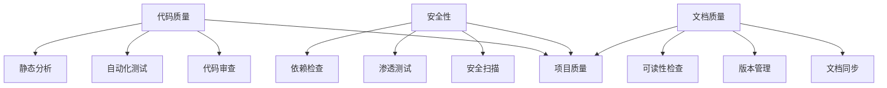
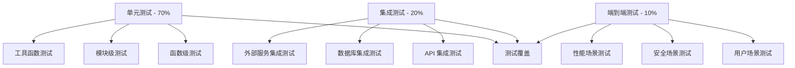
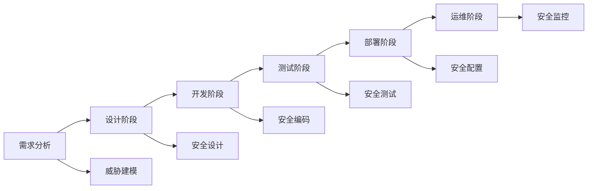
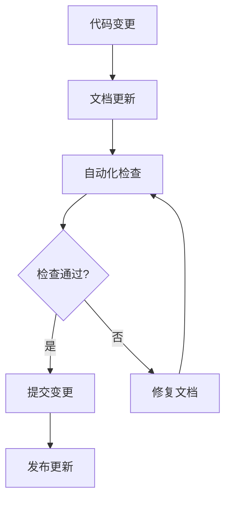
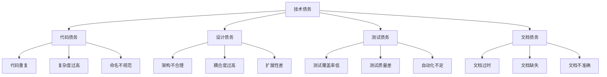

# Elizabeth 项目质量保证指南

## 概述

本文档为 Elizabeth
项目提供全面的质量保证指导，包括代码质量、安全性、文档维护和长期改进策略。基于项目的安全审查结果，制定相应的预防措施和最佳实践。

## 质量保证框架

### 三层质量保证体系



## 代码质量保证

### 1. 代码审查流程

#### 强制性代码审查

**审查范围**：

- 所有新功能代码
- 安全相关修改
- 核心业务逻辑变更
- API 接口修改

**审查要点**：

- 安全性实现
- 代码风格一致性
- 性能影响评估
- 测试覆盖率

**审查工具**：

- GitHub Pull Request 审查
- 代码质量检查工具（如 clippy）
- 安全扫描工具集成

#### 审查检查清单

```markdown
## 代码审查检查清单

### 安全性

- [ ] 密码是否正确哈希存储
- [ ] 输入验证是否充分
- [ ] 权限检查是否完整
- [ ] SQL 注入防护是否到位
- [ ] XSS 防护是否实施

### 代码质量

- [ ] 代码风格符合项目规范
- [ ] 函数和变量命名清晰
- [ ] 错误处理完善
- [ ] 资源管理正确
- [ ] 无硬编码敏感信息

### 测试

- [ ] 单元测试覆盖核心逻辑
- [ ] 集成测试覆盖关键路径
- [ ] 安全测试覆盖风险点
- [ ] 性能测试验证要求

### 文档

- [ ] API 文档更新
- [ ] 代码注释充分
- [ ] 变更日志记录
- [ ] 部署文档更新
```

### 2. 自动化测试策略

#### 测试金字塔



#### 测试实施要求

**单元测试**：

- 覆盖率要求：≥ 80%
- 重点测试：业务逻辑、数据处理、安全验证
- 工具：cargo test, tarpaulin

**集成测试**：

- API 端点测试
- 数据库操作测试
- 第三方服务集成测试

**安全测试**：

- 认证授权测试
- 输入验证测试
- 权限边界测试

### 3. 静态代码分析

#### 工具配置

**Clippy 配置**：

```toml
# Cargo.toml
[lints.clippy]
all = "warn"
pedantic = "warn"
nursery = "warn"
unwrap_used = "warn"
expect_used = "warn"
panic = "warn"
unimplemented = "warn"
```

**安全扫描工具**：

- cargo-audit：依赖漏洞扫描
- cargo-deny：许可证和依赖检查
- rustsec：安全 advisory 数据库

## 安全性保证

### 1. 安全开发生命周期

#### 安全检查点



### 2. 安全编码规范

#### 密码处理

**禁止做法**：

```rust
// ❌ 错误：明文存储密码
pub fn new(name: String, password: Option<String>) -> Self {
    Self {
        password, // 直接存储明文
        // ...
    }
}
```

**正确做法**：

```rust
// ✅ 正确：使用哈希存储密码
use argon2::{Argon2, PasswordHash, PasswordHasher, PasswordVerifier};
use argon2::password_hash::{rand_core::OsRng, SaltString};

pub fn hash_password(password: &str) -> Result<String, AuthError> {
    let salt = SaltString::generate(&mut OsRng);
    let argon2 = Argon2::default();
    let password_hash = argon2
        .hash_password(password.as_bytes(), &salt)
        .map_err(|_| AuthError::HashingError)?;
    Ok(password_hash.to_string())
}
```

#### 输入验证

**验证原则**：

- 所有外部输入必须验证
- 使用白名单而非黑名单
- 验证长度、格式、内容
- 防止注入攻击

**示例实现**：

```rust
use regex::Regex;
use validator::{Validate, ValidationError};

#[derive(Validate)]
pub struct CreateRoomRequest {
    #[validate(length(min = 1, max = 100))]
    pub name: String,

    #[validate(length(min = 8, max = 128))]
    #[validate(regex = "^(?=.*[a-z])(?=.*[A-Z])(?=.*\\d)(?=.*[@$!%*?&])[A-Za-z\\d@$!%*?&]")]
    pub password: Option<String>,
}
```

#### 权限检查

**检查原则**：

- 每个操作都要验证权限
- 使用最小权限原则
- 实施权限继承机制
- 记录权限检查日志

**示例实现**：

```rust
pub async fn delete_room(
    Path(name): Path<String>,
    State(app_state): State<Arc<AppState>>,
    auth_user: AuthUser, // 添加认证中间件
) -> impl IntoResponse {
    // 1. 验证房间存在
    let room = verify_room_exists(&app_state, &name).await?;

    // 2. 检查权限
    if !auth_user.can_delete_room(&room) {
        return Err(HttpResponse::Forbidden().message("Insufficient permissions"));
    }

    // 3. 执行删除操作
    // ...
}
```

### 3. 安全测试

#### 安全测试用例

**认证测试**：

- 弱密码检测
- 暴力破解防护
- 会话管理
- 令牌刷新机制

**授权测试**：

- 权限绕过测试
- 水平权限越界
- 垂直权限越界
- 权限继承测试

**输入验证测试**：

- SQL 注入测试
- XSS 攻击测试
- 路径遍历测试
- 缓冲区溢出测试

## 文档质量保证

### 1. 文档同步机制

#### 自动化文档检查

**检查脚本示例**：

```bash
#!/bin/bash
# docs-check.sh

echo "检查文档与代码同步..."

# 检查 API 文档是否与路由定义一致
cargo run --bin doc-checker -- check-api

# 检查模型文档是否与结构体定义一致
cargo run --bin doc-checker -- check-models

# 检查文档链接有效性
cargo run --bin doc-checker -- check-links

echo "文档检查完成"
```

#### 文档更新流程



### 2. 文档质量标准

#### 文档结构要求

**API 文档**：

- 端点路径和方法
- 请求参数和响应格式
- 错误码和处理
- 认证要求
- 使用示例

**模型文档**：

- 字段定义和类型
- 约束和验证规则
- 关联关系
- 业务规则

**系统文档**：

- 架构概述
- 组件交互
- 数据流
- 部署要求

#### 文档可读性标准

**写作规范**：

- 使用清晰简洁的语言
- 提供充分的上下文
- 包含实际示例
- 保持格式一致性

**技术规范**：

- 代码示例可执行
- 配置参数完整
- 错误处理说明
- 性能考虑

## 长期质量改进策略

### 1. 技术债务管理

#### 技术债务分类



#### 债务管理流程

1. **识别债务**：
   - 定期代码审查
   - 自动化工具扫描
   - 团队反馈收集

2. **评估优先级**：
   - 影响程度评估
   - 修复成本估算
   - 业务价值分析

3. **制定计划**：
   - 短期修复计划
   - 长期重构策略
   - 资源分配方案

4. **执行和跟踪**：
   - 迭代式修复
   - 进度监控
   - 效果评估

### 2. 持续集成和部署

#### CI/CD 流水线配置

```yaml
# .github/workflows/quality-check.yml
name: Quality Check

on: [push, pull_request]

jobs:
  test:
    runs-on: ubuntu-latest
    steps:
      - uses: actions/checkout@v3

      - name: Setup Rust
        uses: actions-rs/toolchain@v1
        with:
          toolchain: stable
          components: rustfmt, clippy

      - name: Format check
        run: cargo fmt -- --check

      - name: Clippy check
        run: cargo clippy -- -D warnings

      - name: Run tests
        run: cargo test --all-features

      - name: Security audit
        run: cargo audit

      - name: Documentation check
        run: ./scripts/docs-check.sh
```

### 3. 监控和告警

#### 质量指标监控

**代码质量指标**：

- 测试覆盖率趋势
- 代码复杂度变化
- 技术债务积累
- 缺陷密度统计

**安全指标**：

- 漏洞发现和修复时间
- 安全测试覆盖率
- 依赖漏洞数量
- 安全事件统计

**文档质量指标**：

- 文档覆盖率
- 文档准确性评分
- 文档更新频率
- 用户反馈统计

#### 告警机制

```yaml
# 质量告警规则
alerts:
  - name: "测试覆盖率下降"
    condition: "coverage < 80%"
    severity: "warning"
    action: "通知开发团队"

  - name: "安全漏洞发现"
    condition: "vulnerabilities > 0"
    severity: "critical"
    action: "立即修复"

  - name: "文档同步失败"
    condition: "doc_sync_status != 'success'"
    severity: "warning"
    action: "更新文档"
```

## 团队培训和知识管理

### 1. 安全培训计划

#### 培训内容

**基础安全知识**：

- 常见安全漏洞类型
- 安全编码原则
- 威胁建模方法
- 安全测试技术

**项目特定安全**：

- Elizabeth 安全架构
- 认证授权机制
- 数据保护措施
- 安全监控方案

#### 培训实施

- 新员工入职培训
- 定期安全培训（季度）
- 安全意识宣传
- 安全演练活动

### 2. 知识管理

#### 知识库建设

**技术文档**：

- 架构设计文档
- API 接口文档
- 部署运维文档
- 故障处理手册

**最佳实践**：

- 编码规范
- 安全实践
- 测试策略
- 文档标准

#### 知识分享机制

- 技术分享会
- 代码审查会议
- 经验总结文档
- 问题解决方案库

## 总结

本质量保证指南为 Elizabeth
项目提供了全面的质量管理框架，涵盖了代码质量、安全性、文档维护和长期改进的各个方面。

### 关键成功因素

1. **领导支持**：管理层对质量的重视和投入
2. **团队参与**：全体团队成员的质量意识
3. **工具支持**：自动化工具的有效应用
4. **持续改进**：基于反馈的持续优化

### 实施建议

1. **分阶段实施**：根据项目现状分阶段推进
2. **重点突破**：优先解决关键质量问题
3. **工具先行**：先建立自动化工具链
4. **文化培养**：逐步建立质量文化

通过系统性地实施这些质量保证措施，Elizabeth
项目将能够持续提升代码质量、安全性和可维护性，为用户提供更可靠的服务。

---

**文档版本**：v1.0 **创建日期**：2025-10-21 **维护周期**：季度审查和更新
**负责人**：项目质量保证团队
